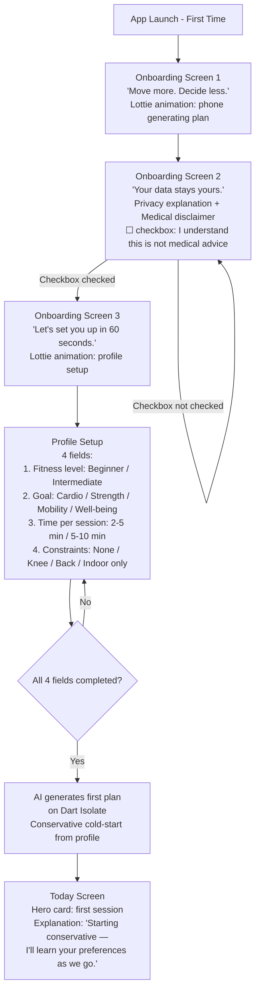
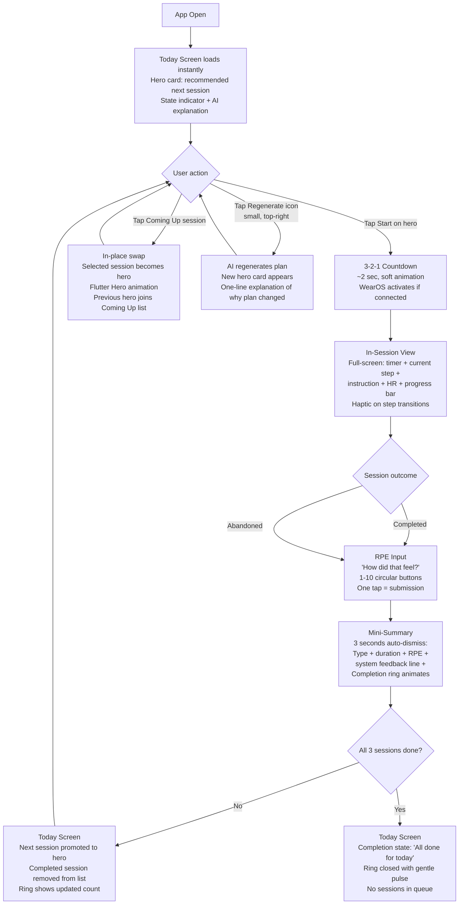
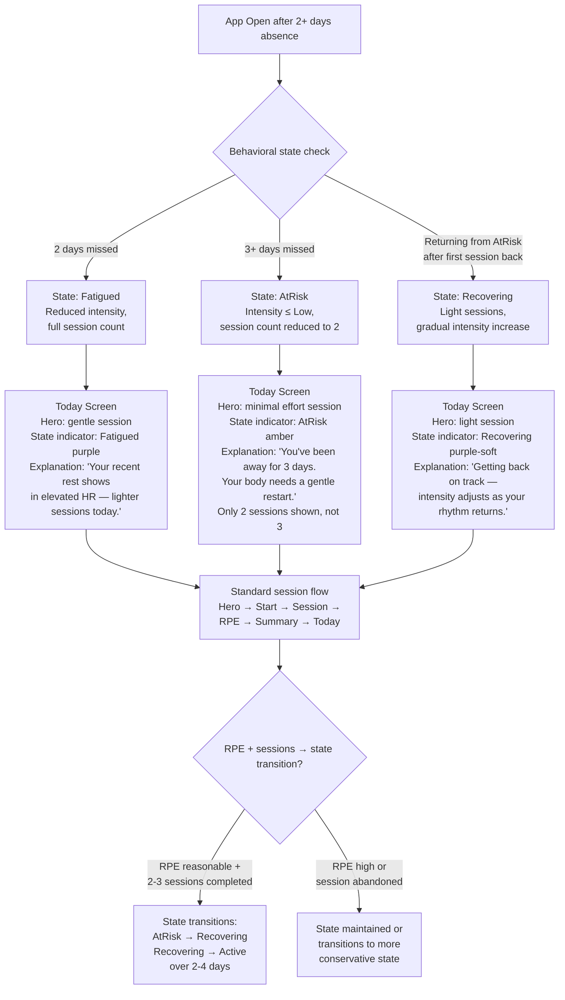
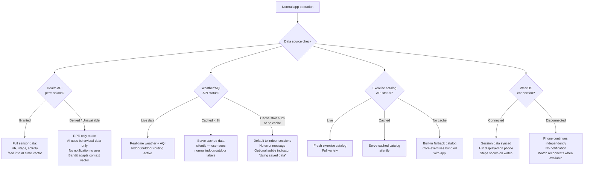

# UX Design Specification — PulseCoach

**Author:** Paolo
**Date:** 2026-03-26

---

## Executive Summary

### Project Vision

PulseCoach is a friction-removal tool disguised as a fitness app. The core UX promise is radical simplicity: open the app, receive a calibrated plan in under 30 seconds, one tap to start. The adaptive intelligence — contextual bandit, behavioral state machine, RPE feedback loop — must be entirely invisible to the user. What surfaces is a single recommended session with a one-line human-readable explanation. The system earns trust not through complexity, but through accuracy and transparency: "the app figured out what I needed before I did."

The product targets the moment *before* the decision to exercise — when willpower exists but planning friction kills action. This reframes PulseCoach from "workout tool" to "activation tool," and the UX must reflect this: every screen, every interaction, every micro-decision must reduce cognitive load rather than add to it.

### Target Users

**Primary — Students and remote/hybrid workers (18-35, moderately tech-savvy)**

Two groups with the same core problem: fragmented schedules, fluctuating energy, and repeated failure with traditional fitness apps that demand planned intent. They are not inactive — they keep trying and friction keeps winning.

- **Students (e.g., Marco):** Irregular sleep, unpredictable gaps between lectures, limited motivation bandwidth. Need: something that fits in a 5-minute gap without requiring any decision.
- **Remote workers (e.g., Elena):** 6-8 hours seated, micro-gaps between meetings, afternoon energy crashes. Need: a 3-minute reset that doesn't feel like "exercise" but breaks sedentary inertia.

**Secondary — Wearable users seeking actionable coaching**

Users who already track HR and steps but want their data to drive actual recommendations, not just dashboards.

**UX literacy level:** Moderately tech-savvy but the AI complexity must be invisible. Users see "recommended session + one-line explanation," never algorithms, state vectors, or epsilon values. The debug/AI Decision Log exists for power users and demo purposes only — never surfaced in the default experience.

### Key Design Challenges

1. **Zero-decision activation under 30 seconds.** The Today screen must present a ready-to-start plan immediately on app open. Any friction — loading states, modals, configuration prompts — risks losing the user at the exact moment they had the impulse to move. The UX must feel instant.

2. **Empathy without guilt.** Fitness apps weaponize streaks, missed-session counters, and aggressive notifications. PulseCoach must communicate state transitions (Active → Fatigued → AtRisk → Recovering) with warmth, not shame. "We're giving you space to recover" instead of "You missed 3 days!" This is a fundamental tone-of-voice design challenge that runs through every screen.

3. **AI invisibility with earned trust.** The three-layer AI stack (safety rules + bandit + state machine) is the technical core, but the UX must make it disappear. The only visible output is: session recommendation + one-line explanation. The explanation must feel like a knowledgeable friend, not a diagnostic report — concise, warm, accurate.

4. **Dual layout that feels native to each form factor.** Phone and tablet layouts must be visually and functionally distinct — not scaled versions of each other. Phone: vertical, thumb-friendly, focused single-task. Tablet: information-dense, dashboard-oriented, multi-pane. Both must feel intentionally designed for their context.

5. **Calm premium aesthetic in a loud fitness market.** The visual language must break from aggressive fitness app conventions (red/orange, bold caps, gym imagery). The mood is energetic-but-calm: closer to Calm, Oura, Whoop than Nike Training Club or Freeletics. Dark mode first, soft accents (aqua green or muted violet), clean typography, generous whitespace.

### Design Opportunities

1. **Explainability as signature interaction.** No fitness app explains its recommendations. The one-line structured reason ("Intensity reduced: short sleep + elevated resting HR") is the product's signature UX moment — the instant the user feels *understood* by the system. This must be designed as a first-class UI element, not an afterthought tooltip.

2. **Empathetic state messaging as emotional design.** The behavioral state machine transitions (especially entering Recovering) are opportunities for micro-moments of emotional connection. When the app says "light sessions today — your body needs space" before the user consciously recognizes their own fatigue, it creates a trust bond that no competitor offers.

3. **Session experience as micro-ritual.** A 3-5 minute guided session with timer, step transitions, haptic feedback, and WearOS sync can feel like a polished micro-ritual rather than a workout. Design the in-session flow as a calm, focused, almost meditative experience — reinforcing the premium positioning.

4. **Progress that celebrates consistency over intensity.** Charts and history should reward showing up, not lifting more. RPE trending toward target, sessions per week, active minutes — metrics that validate sustainable habit formation rather than peak performance.

5. **Tablet as coaching dashboard.** The tablet layout is an opportunity to create a rich, information-dense coaching overview — multiple charts visible simultaneously, master-detail session exploration, split-view in-session — positioning PulseCoach as a serious adaptive coaching system for users who want depth.

## Core User Experience

### Defining Experience

The core loop of PulseCoach is a five-step micro-ritual that should feel inevitable rather than effortful:

1. **Open** — Today screen loads instantly with the daily plan already generated
2. **Read** — One-line AI explanation visible on each session card, building trust passively
3. **Start** — Single tap, followed by a brief 3-2-1 countdown (~2 seconds) with light animation. The countdown is intentional: it marks the transition from planning to action as a micro-ritual, not a delay
4. **Do** — Full-screen guided session with timer, current step, HR, haptic step transitions. Calm, focused, distraction-free
5. **Close** — Post-session: RPE tap (1-10) → 3-second mini-summary (session type, duration, RPE recorded, one-line system feedback: "Great. Adjusting intensity tomorrow.") → automatic return to Today with session marked complete. The user does nothing — the app resolves itself

The entire loop — from app open to session start — must complete in under 30 seconds. The entire loop — from session end to app idle — must complete in under 10 seconds. The user never navigates, configures, or decides. The app decides, explains, executes, and resolves.

### Platform Strategy

**Device hierarchy:**

| Device | Role | Navigation | Layout Strategy |
|---|---|---|---|
| Phone (primary) | Daily driver — plan, execute, feedback | Bottom tabs (Today, Sessions, Progress) + Drawer | Vertical, single-column, thumb-zone optimized. Full-screen session view |
| Tablet (secondary) | Coaching dashboard — review, explore, analyze | Side NavigationRail + master-detail | Information-dense, multi-pane. Dashboard grid for Progress, split-view in-session |
| WearOS (tertiary) | In-session companion — glanceable display | Minimal — session-driven only | Current step, timer, live HR. Post-session summary. No navigation, no AI logic |

**Offline-first by design:** All core features work without network. API data (weather, AQI, exercises) cached with TTL. The user should never see a loading spinner for the Today plan — it is computed locally, instantly.

**Touch-first interaction model:** All primary actions reachable with one hand on phone. Tap targets ≥ 48dp. Swipe gestures reserved for secondary actions only (e.g., dismiss summary). No long-press for critical functions.

### Effortless Interactions

**What must feel automatic:**
- Daily plan generation — happens before the user opens the app (or instantly on open). Zero wait.
- Indoor/outdoor routing — the system checks weather and AQI silently. The user sees "indoor" or "outdoor" as a label, never a choice.
- State machine transitions — the system adjusts silently. The user sees the *result* ("light sessions today") not the *process* (state: Recovering).
- Sensor integration — HR, steps, activity data flow into the AI without user action. No "sync your data" prompt.

**What must feel intentional (micro-ritual design):**
- The "Start" tap — a deliberate, single action that commits the user to the session
- The 3-2-1 countdown — a brief, calm transition that creates psychological readiness
- The RPE feedback tap — the only thing the app asks of the user post-session, and it must feel quick and meaningful, not tedious
- The mini-summary — 3 seconds of closure before the app auto-resolves back to Today

**What competitors require that PulseCoach eliminates:**
- Choosing a workout type, duration, difficulty, or muscle group
- Configuring today's schedule or setting a workout time
- Deciding whether to exercise indoors or outdoors
- Reading multi-paragraph explanations of why a workout was recommended
- Navigating back to a home screen after completing a session

### Critical Success Moments

1. **First open → first plan (< 30 seconds).** The user sees a calibrated, personalized plan on their first app open after onboarding. If the Today screen feels empty, generic, or slow, the product has failed at its core premise. This is the single most important UX moment.

2. **First explanation read.** The user reads "Intensity reduced: short sleep + elevated resting HR" under their first session and thinks "it actually noticed." This is the trust trigger — the moment PulseCoach stops being "another fitness app" and becomes "something that understands me."

3. **First empathetic state message.** After a missed streak or high-RPE days, the user opens the app expecting guilt. Instead: "We're giving you space to recover — light sessions today." This is the emotional loyalty moment. If the tone feels robotic or preachy, the opportunity is wasted.

4. **First completed session.** The 3-2-1 countdown → guided steps → haptic transitions → RPE → mini-summary → auto-return must feel polished, calm, and complete. If the in-session experience feels clunky, the user won't come back for session two.

5. **Day 10 realization.** The user notices they've been consistently active without planning anything. The system adapted to their schedule, energy, and preferences without configuration. This is the long-term retention moment — the silent proof that the AI works.

### Experience Principles

1. **Decide for the user, explain after.** Every screen should present a decision already made, with a one-line explanation of why. Never ask the user to choose when the system can choose better. The explanation is always visible — not hidden behind a tap — because transparency is the product's signature, not a secondary feature.

2. **Warmth over metrics.** Communicate in human terms, not data terms. "Light sessions today — your body needs space" instead of "State: Recovering, intensity cap: Low." RPE is the only number the user inputs; everything else is translated into language.

3. **Resolve, don't linger.** Every interaction should close itself. Post-session summary auto-returns to Today. Regenerated plans show a one-line reason and settle. The app never leaves the user in a state that requires a decision to exit.

4. **Calm energy, not gym aggression.** Visual and interaction design should feel like a premium wellness companion — Calm meets Oura — not a personal trainer shouting from a screen. Dark mode first, soft accents, generous whitespace, clean typography, no exclamation marks.

5. **Invisible intelligence, visible care.** The AI complexity (bandit, state machine, safety rules) is never surfaced. What the user sees is care: the right session at the right time, an explanation that proves observation, a tone that acknowledges their state. The technology disappears; the thoughtfulness remains.

## Desired Emotional Response

### Primary Emotional Goals

**Core emotion: Capable.** After every session, the user should feel quietly capable — not euphoric, not exhausted. The sensation of "I had 5 minutes and I used them well." A small, silent victory. Not a celebration — a confirmation of agency.

**Trust emotion: Understood.** The AI explanations should make the user feel observed and known — not surveilled. The system noticed their sleep, their heart rate, their patterns. It used that information wisely. The user feels like they have a competent, quiet ally.

**Return emotion: Competence, not welcome.** When the user returns after absence, the app demonstrates continued observation: "Your body has rested — here's what it needs now." No false warmth ("Welcome back!"), no guilt. The system proves it was paying attention even when the user wasn't. This is more emotionally powerful than any greeting.

### Emotional Journey Mapping

| Stage | Desired Emotion | Anti-Pattern to Avoid |
|---|---|---|
| **First open (onboarding)** | Curiosity + relief ("this is simpler than I expected") | Overwhelm, signup fatigue, skepticism |
| **First plan seen** | Quiet surprise ("it already knows something about me") | Emptiness, generic content, distrust |
| **First explanation read** | Trust trigger ("it actually noticed") | Confusion, robotic tone, data overload |
| **Session countdown (3-2-1)** | Calm readiness, intentional commitment | Anxiety, impatience, pressure |
| **During session** | Present focus, flow state | Distraction, boredom, frustration with UI |
| **RPE feedback** | Quick agency ("my input matters") | Tedium, obligation, survey fatigue |
| **Post-session summary** | Capable — "I did something real in 5 minutes" | Guilt for low RPE, pressure to do more |
| **All 3 sessions complete** | Quiet satisfaction — the circle closes | Loud celebration, badge noise, streak pressure |
| **Error / degradation** | Unaware — the system handled it silently | Alarm, error modals, "something went wrong" messaging |
| **Return after absence** | Competence — "it kept observing, it knows what I need now" | Guilt, missed-streak counters, "you've been away!" |
| **Day 10+ (habitual use)** | Invisible consistency — "I've been active without thinking about it" | Dependence on streaks, plateau boredom |

### Micro-Emotions

**Critical emotional axes for PulseCoach:**

- **Confidence over confusion.** Every screen presents clarity. The user never wonders "what should I do?" The plan is there, the explanation is there, the Start button is there. Zero ambiguity.
- **Trust over skepticism.** The one-line explanation earns trust incrementally. By day 3-4, the user stops questioning and starts relying. The explanation accuracy is the trust engine.
- **Accomplishment over frustration.** Even a 3-minute breathing session counts. The system never frames anything as "not enough." Every completed session is a quiet win.
- **Calm over anxiety.** The visual language, the tone of voice, the pacing — everything reduces arousal rather than amplifying it. No urgency, no countdowns to deadlines, no "you should be doing more."

### Design Implications

| Emotional Goal | UX Design Approach |
|---|---|
| **Capable** | Post-session summary is minimal and affirming: type + duration + RPE + one line of system feedback. Auto-resolves in 3 seconds. No "share your workout" prompt, no social comparison |
| **Understood** | AI explanation always visible on session card — one line, human language, accurate. Never hidden behind a tap. This is the product's emotional signature |
| **Invisible errors** | Sensor unavailable → system continues silently with available data. API offline → serve cache without notification. Only if strictly necessary: neutral, reassuring message ("Using saved data."). Never red, never modal, never alarming |
| **Competence on return** | After absence: state machine message shows awareness ("Your body has rested — light sessions today, intensity adjusts as your rhythm returns"). No welcome-back banner, no missed-day count, no streak reset notification |
| **Quiet delight** | All 3 daily sessions complete → subtle animation: a completion ring closes with a gentle pulse effect on the Today screen. No confetti, no badges, no sound. The silence is part of the reward. The visual moment says "done" — nothing more |
| **Calm readiness** | 3-2-1 countdown uses soft animation, no aggressive colors or sounds. The transition from planning to doing is a deliberate, peaceful threshold |
| **Quick agency (RPE)** | RPE input is a single row of tappable numbers (1-10), large targets, instant registration. No confirmation dialog, no "are you sure?" One tap and it's recorded |

### Emotional Design Principles

1. **Silence is a feature.** The absence of noise — no badges, no streaks, no push notifications, no celebration screens — is itself a design choice that communicates respect. PulseCoach earns attention by being quiet. The user notices what the app *doesn't* do as much as what it does.

2. **Competence over congratulation.** Never celebrate the user — empower them. "Done" is better than "Amazing job!" A closing ring is better than confetti. The user's sense of capability comes from having acted, not from being praised. Praise feels patronizing when the session was 3 minutes of breathing.

3. **Errors are the system's problem, not the user's.** Technical failures (sensor gaps, API timeouts, stale data) are handled invisibly. The user should never feel like something broke or that their experience is degraded. Graceful degradation is not a fallback — it is the primary design pattern for all error states.

4. **Observation without surveillance.** The line between "the app understands me" and "the app is watching me" is drawn by tone. Explanations reference states ("elevated resting HR," "short sleep detected") without making them feel clinical. The system is a perceptive coach, not a diagnostic tool.

5. **Consistency of emotional temperature.** Every screen, every message, every animation maintains the same emotional register: calm, competent, respectful. No screen is louder or more energetic than any other. The app has one emotional voice, and it never raises it.

## UX Pattern Analysis & Inspiration

### Inspiring Products Analysis

**Spotify — "Autoplay decides for you"**
- **Core UX lesson:** The user doesn't choose the next song — the system does, and it's usually right. Over time, the user stops thinking about selection entirely and enters a flow state of passive consumption. This is the exact mental model PulseCoach needs for session selection: the system decides, the user acts.
- **Transferable pattern:** Autoplay-as-default. The Today screen presents sessions as a ready-to-play queue, not a catalog to browse. The user's relationship with the plan is "trust and start," not "evaluate and choose."
- **What makes it sticky:** The more you use it, the better it gets — and you can *feel* it improving. The same must be true for PulseCoach's bandit recommendations.

**Oura Ring — "One number, one sentence, one action"**
- **Core UX lesson:** The daily Readiness Score reduces complex biometric data (HRV, resting HR, temperature, sleep stages) into a single number + a one-line interpretation: "Your body is ready for a challenge" or "Take it easy today." The user gets actionable insight without needing to understand the underlying data.
- **Transferable pattern:** The behavioral state (Active, Fatigued, AtRisk, Recovering) is PulseCoach's equivalent of the Readiness Score. It should be presented with the same clarity: a state label + a one-line human interpretation. Not four metrics — one synthesis.
- **Visual reference:** Dark backgrounds, muted accent colors, generous spacing, data presented as narrative rather than dashboard. This is the primary visual reference for PulseCoach.

**Duolingo — "Inevitable linear flow"**
- **Core UX lesson:** Once a lesson starts, the user cannot get lost. There are no menus, no branching paths, no decisions. The flow is: question → answer → feedback → next question. The user's only job is to keep going. Sessions are short (3-5 minutes), completion feels effortless, and the app resolves itself when done.
- **Transferable pattern:** PulseCoach's in-session flow must be equally linear and inevitable: exercise step → timer → haptic transition → next step → done → RPE → summary → auto-return. No navigation during session, no decisions, no branching. The only exit is "abandon session" — and even that should be graceful.
- **Friction reduction lesson:** Duolingo's genius is that the session *starts* with almost zero friction. PulseCoach needs the same: one tap on the Today screen, 3-2-1 countdown, session running.

**Headspace — "Calm ritual design"**
- **Core UX lesson:** Headspace treats each meditation session as a ritual: a calm transition screen, a brief introduction, the session itself, and a gentle completion moment. The emotional temperature never spikes. The app feels like entering a quiet room.
- **Transferable pattern:** PulseCoach's session flow — countdown → guided steps → summary → auto-return — should have the same ritual quality. The transition moments (countdown, step changes, completion) should feel like thresholds, not interruptions.
- **Visual reference:** Soft illustrations, rounded shapes, pastel-on-dark palette. Headspace proves that fitness-adjacent products can use calming visual language without feeling weak.

**Things 3 — "Clean task resolution"**
- **Core UX lesson:** When a task is completed, it disappears with a satisfying but minimal animation. The interface resolves itself — completed items don't linger to create visual noise. The experience of completion is clean and final.
- **Transferable pattern:** PulseCoach's session completion should follow the same principle: completed sessions on the Today screen are visually marked as done (not removed — the user should see progress) with a clean state change. The completion ring closing with a gentle pulse mirrors Things 3's check animation — minimal, satisfying, done.

### Transferable UX Patterns

**Navigation Patterns:**

| Pattern | Source | PulseCoach Application |
|---|---|---|
| Autoplay queue | Spotify | Today screen presents sessions as a pre-built queue. No browsing required to start. The first session is the default action |
| Linear session flow | Duolingo | In-session experience is a single linear path: step → step → step → done. No menus, no branching, no navigation |
| Bottom tabs + drawer | Things 3, Headspace | Phone: 3 bottom tabs (Today, Sessions, Progress) for primary navigation + drawer for secondary (Profile, Settings, Privacy). Clean hierarchy |

**Interaction Patterns:**

| Pattern | Source | PulseCoach Application |
|---|---|---|
| One-number synthesis | Oura Readiness Score | Behavioral state (Active/Fatigued/AtRisk/Recovering) presented as a single state + one-line explanation. Not raw metrics |
| Effortless session start | Duolingo "Start" button | Single prominent "Start" button on each session card. One tap → 3-2-1 countdown → session running. Under 5 seconds from decision to action |
| Self-resolving completion | Things 3 task check | Post-session: RPE tap → 3-sec summary → auto-return to Today. The flow closes itself. User does nothing to "go back" |
| Passive personalization | Spotify Discover Weekly | The bandit learns and adapts silently. The user notices results ("sessions are getting better") without configuring anything |

**Visual Patterns:**

| Pattern | Source | PulseCoach Application |
|---|---|---|
| Dark-first, muted accents | Oura Ring app | Dark background as default. Soft aqua green or muted violet accents. No bright primary colors competing for attention |
| Narrative data presentation | Oura | Progress data presented as human-readable narrative ("Your activity this week: consistent, slightly lower intensity than last week") not just charts |
| Calm transitions | Headspace | All screen transitions, session start/end, and step changes use gentle, non-jarring animations. No bouncing, no zooming, no flash |
| Generous whitespace | Things 3 | Every screen has breathing room. Content is not packed edge-to-edge. Information density is controlled, not maximized (exception: tablet dashboard) |

### Anti-Patterns to Avoid

| Anti-Pattern | Why It Fails | PulseCoach Alternative |
|---|---|---|
| **Empty home screen** ("Choose your workout") | Forces the user to make the exact decision they came to avoid. The planning friction that PulseCoach exists to eliminate | Today screen always has a pre-generated plan. Never empty, never waiting for user input |
| **Progress shaming** ("You missed 3 days" + red icons + broken streak) | Weaponizes guilt. Punishes the user for being human. Destroys the emotional safety needed for long-term retention | State machine acknowledges absence with competence: "Your body rested — here's what it needs now." No counters, no red, no shame |
| **Metric overload** (15 numbers on one dashboard) | Overwhelms without contextualizing. The user sees data but doesn't know what to *do* with it. Cognitive load without actionable insight | Phone Progress screen: 3-4 key metrics with human-readable context. Tablet dashboard: more metrics visible but still curated and contextualized |
| **Endless onboarding** (10+ screens before first value) | Delays the "aha moment" that determines retention. Every additional onboarding screen increases drop-off probability | 3 animated screens (concept → privacy → setup) + 4-field profile. Under 60 seconds to first plan. Medical disclaimer is mandatory but single-screen |
| **Aggressive notifications** ("Hey! You haven't worked out today!" at 10pm) | Violates the user's attention boundaries. Creates resentment, not motivation. Tone-deaf to context | v1: No push notifications. The app is available when the user chooses to open it. Silence as respect. Notifications deferred to post-MVP with strict tone guidelines |
| **Celebration theater** (confetti, badges, "AMAZING JOB!" after a 3-min stretch) | Disproportionate praise feels patronizing and artificial. Undermines the user's sense of competence by treating trivial actions as achievements | Quiet completion: ring closes with gentle pulse. System feedback is factual and forward-looking ("Got it. Adjusting intensity tomorrow."). No exclamation marks |

### Design Inspiration Strategy

**Adopt directly:**
- Spotify's autoplay mental model → Today screen as pre-built session queue
- Oura's one-number synthesis → Behavioral state as single label + one-line explanation
- Duolingo's linear session flow → In-session experience with zero branching
- Things 3's self-resolving completion → Post-session auto-return to Today
- Headspace's calm ritual transitions → Session start/end as peaceful thresholds

**Adapt for PulseCoach context:**
- Oura's dark visual language → Adapt for fitness context (slightly more energetic than pure wellness, but never aggressive). Add motion and activity-appropriate accents while maintaining the calm base
- Duolingo's friction-free start → Adapt with 3-2-1 countdown as intentional micro-ritual (Duolingo starts instantly; PulseCoach adds a 2-second preparation moment because physical activity benefits from psychological readiness)
- Things 3's minimal completion → Adapt with the completion ring pulse (Things 3 removes completed items; PulseCoach keeps them visible but marked, so the user sees daily progress accumulating)

**Reject explicitly:**
- Freeletics/Nike TC aggressive gym aesthetic → Conflicts with calm energy principle
- Fitbit/Apple Health multi-metric dashboards → Conflicts with "warmth over metrics" principle (phone only; tablet can be denser)
- Any streak-based retention mechanic → Conflicts with "empathy without guilt" emotional design
- Any celebration that exceeds the effort invested → Conflicts with "competence over congratulation" principle
- Any notification that implies the user *should* be doing something → Conflicts with "silence is a feature" principle

## Design System Foundation

### Design System Choice

**Material 3 with selective custom components** — a hybrid approach that uses Material Design 3 (`useMaterial3: true`) as the structural foundation while building custom components for the moments that define PulseCoach's identity.

**The split:**
- **Material 3 (structural):** NavigationBar, NavigationRail, AppBar, Scaffold, Drawer, Card (base), ListTile, TextField, Dialog, SnackBar, Switch, Slider. These are the invisible infrastructure — they should feel standard, accessible, and fast to build.
- **Custom components (identity):** Session card (Today screen), in-session view (full-screen guided session), 3-2-1 countdown animation, completion ring + pulse, RPE input buttons, behavioral state indicator, AI explanation line, post-session mini-summary. These are the moments the user *remembers* — they must feel uniquely PulseCoach.

### Rationale for Selection

1. **Development speed.** A team of 2-3 with an exam deadline cannot build every component from scratch. Material 3 provides accessible, tested, responsive components for navigation, layout, and standard interactions — freeing development time for the components that matter.

2. **Academic compliance.** The DIMA course recommends Material Design. Using Material 3 as the base demonstrates framework proficiency. Custom components on top demonstrate design maturity — both are evaluation criteria (complexity + look and feel).

3. **Identity where it counts.** Users spend 80% of their time on three screens: Today (session cards), in-session (timer + steps), and the post-session flow (RPE + summary). Custom components on these screens create a distinctive identity without rebuilding the entire design system.

4. **Accessibility for free.** Material 3 components ship with semantic labels, contrast compliance, touch targets, and screen reader support. Custom components must match these standards but start from a proven baseline.

5. **Dark mode support.** Material 3's `ColorScheme.fromSeed()` with `brightness: Brightness.dark` generates a compliant dark palette from a single seed color. Custom components consume the same theme tokens, ensuring consistency.

### Implementation Approach

**Theme architecture:**

```
ThemeData (Material 3 base)
├── ColorScheme.fromSeed(seedColor, brightness: dark)
│   ├── Override: surface, background, primary, secondary, tertiary
│   └── Custom: extended color roles for PulseCoach-specific states
├── TextTheme (custom font family assignments)
├── CardTheme, AppBarTheme, NavigationBarTheme (Material overrides)
└── Extensions: PulseCoachTheme (custom tokens for session cards, RPE, etc.)
```

**Custom component inventory:**

| Component | Screen | Why Custom |
|---|---|---|
| SessionCard | Today | The primary interaction surface. Must show session type, duration, intensity, AI explanation — all in a distinctive visual format that doesn't look like a standard Material Card |
| InSessionView | Session (full-screen) | The core experience. Timer, current step, HR, progress bar. Must feel like a focused ritual space, not a Material scaffold |
| CountdownOverlay | Session transition | The 3-2-1 micro-ritual. Animated, calm, distinctive. No Material equivalent |
| CompletionRing | Today | The quiet delight moment. A circular progress indicator that pulses on completion. Custom animation, not a standard CircularProgressIndicator |
| RPEInput | Post-session | A single row of 10 tappable numbers with immediate visual feedback. Must feel quick and tactile, not like a standard Slider or RadioGroup |
| StateIndicator | Today | Behavioral state label (Active/Fatigued/AtRisk/Recovering) + one-line explanation. A custom chip-like component with state-specific color coding |
| ExplanationLine | Session card | The one-line AI reason. Styled distinctly from body text — subtle but always present. Not a standard subtitle |
| MiniSummary | Post-session | The 3-second completion screen. Type + duration + RPE + system feedback. Auto-dismissing. Custom layout and animation |

### Customization Strategy

**Typography system:**

| Role | Font | Weight | Usage |
|---|---|---|---|
| Display / Headlines | Plus Jakarta Sans | SemiBold (600) | Screen titles, onboarding headlines, state labels. Geometric sans-serif with warmth — distinctive without being aggressive |
| Body / Labels | Plus Jakarta Sans | Regular (400), Medium (500) | AI explanations, session descriptions, settings, all readable text. Excellent legibility at small sizes |
| Timer / Numeric | JetBrains Mono | Regular (400) | In-session timer, countdown numbers, RPE display. Monospace conveys technical precision and calm focus. Lighter than most monospace fonts |
| Caption / Metadata | Plus Jakarta Sans | Regular (400) | Duration labels, intensity indicators, timestamps. Small but clear |

**Why Plus Jakarta Sans:** Geometric sans-serif with slightly rounded terminals — warm and modern without being generic (unlike Inter) or trendy (unlike Satoshi). Open-source, excellent Flutter support via Google Fonts. The rounded quality aligns with the Oura/Calm visual reference without feeling soft or childish.

**Why JetBrains Mono for timers:** Monospace fonts in timer contexts create a sense of precision and intentionality. JetBrains Mono is lighter and more readable than most monospace fonts, avoiding the "developer tool" aesthetic while retaining the technical quality. Used exclusively for numeric/timer displays — never for body text.

**Color strategy:**

| Token | Dark Mode Value | Usage |
|---|---|---|
| Surface (background) | `#0F1119` | Primary background — near-black with a cool blue undertone. Not pure black (avoids OLED harshness) |
| Surface Container | `#171B26` | Card backgrounds, elevated surfaces. Subtle lift from base surface |
| Surface Container High | `#1E2333` | Active/selected states, input fields. One step lighter |
| Primary (accent) | `#7DD3C0` | Primary actions (Start button), active states, completion ring. Soft aqua green — energetic but calm |
| Secondary | `#A78BDA` | Secondary actions, behavioral state indicators (Recovering, Fatigued). Muted violet — gentle contrast to primary |
| Tertiary | `#E8C87A` | Warnings (AtRisk state), AQI alerts, attention items. Warm amber — visible without being alarming |
| On Surface | `#E2E4EA` | Primary text on dark surfaces. Not pure white (reduces eye strain) |
| On Surface Variant | `#9498A6` | Secondary text, captions, AI explanation lines. Readable but recessive |
| Error | `#F28B82` | Soft red — used sparingly, only for genuine errors (not shame or warnings) |

**Light mode (secondary):** Generated via Material 3 `ColorScheme.fromSeed()` from the primary aqua green seed. Light mode inverts the hierarchy: light surface with the same accent colors. Not a design priority for v1 — dark mode is the default and demo presentation mode.

**Shape strategy:**
- Card corner radius: 16dp (softer than Material default 12dp — aligns with Oura/Calm aesthetic)
- Button corner radius: 12dp
- Input/chip corner radius: 8dp
- Full-round elements: completion ring, RPE buttons (circular), state indicator dots
- No sharp corners anywhere in the UI — the visual language is consistently rounded

**Elevation strategy (dark mode):**
- Avoid Material's default shadow-based elevation — shadows are invisible on dark surfaces
- Use surface tint (lighter surface colors) to indicate elevation
- Maximum 3 elevation levels: base surface → container → container high
- Session cards: container level. Active/selected: container high level. Modals: container high + scrim

**Animation tokens:**
- Standard transition: 250ms ease-in-out (screen transitions, state changes)
- Micro-interaction: 150ms ease-out (button press, RPE selection feedback)
- Ritual transition: 400ms ease-in-out (countdown numbers, completion ring pulse)
- Auto-dismiss: 3000ms delay + 300ms fade (post-session mini-summary)

## Defining Experience

### The One-Line Test

**"Open the app and it already tells you what to do — and it always guesses how you feel."**

This is how Marco describes PulseCoach to Luca. If every design decision serves this sentence, the product works. If any screen, interaction, or feature contradicts it, it doesn't belong.

The sentence encodes three promises:
1. **"Open the app and it already tells you"** — zero-decision, instant plan, no configuration
2. **"what to do"** — concrete, actionable sessions, not advice or dashboards
3. **"it always guesses how you feel"** — adaptive intelligence that observes and responds accurately

### User Mental Model

**Primary metaphor: A personal DJ who knows your body.**

The user's mental model is not a personal trainer (too demanding), not a meditation guide (too passive), not a fitness tracker (too data-focused). It is an intelligent autoplay system — like Spotify in autoplay mode — that has already chosen the right track for this moment based on who you are and how you feel.

**What this metaphor implies for design:**

| DJ Metaphor | PulseCoach Equivalent | Design Implication |
|---|---|---|
| The DJ picks the next song | The system picks the next session | Today screen presents a ready queue — never asks "what do you want to do?" |
| You press play, not browse | You tap Start, not configure | Single primary action per session card. No dropdown menus, no parameter selection |
| The DJ reads the room | The system reads your body | Sensor data + RPE history feed the AI silently. The user sees the *result* (right session), not the *process* (data collection) |
| You can skip a song | You can regenerate the plan | Regenerate exists but is secondary — like Spotify's skip. Most of the time, the recommendation is right |
| The set flows naturally | The daily plan flows naturally | Three sessions per day should feel like a coherent set, not three random picks. Morning mobility → afternoon breathing → evening cardio has a rhythm |
| A great DJ needs no explanation | A great explanation builds trust | Where the metaphor diverges: unlike a DJ, PulseCoach *explains* its choices. This is the unique layer — the DJ who tells you *why* this song, right now. That's what makes it trustworthy instead of just convenient |

**What users bring from existing solutions:**

- From fitness apps: expectation of workout catalogs, filters, difficulty settings → PulseCoach must *break* this expectation immediately. The onboarding and Today screen must signal "we already chose for you" within seconds.
- From Spotify/music apps: comfort with algorithmic curation that improves over time → PulseCoach can *leverage* this expectation. Users already trust autoplay; they just haven't experienced it for movement.
- From wellness apps (Calm, Headspace): expectation of calm, guided, time-boxed sessions → PulseCoach can *adopt* this framing. A 5-minute mobility session has the same emotional structure as a 5-minute meditation.

### Success Criteria

**The core interaction succeeds when:**

1. **Instant recognition (< 3 seconds).** The user opens the app and immediately understands what they should do next. No scanning, no reading, no deciding. The first session card is the obvious next action.

2. **Explanation accuracy.** The one-line AI explanation matches what the user *feels* about themselves. "Short sleep + elevated HR" when they slept badly. "Low step count" when they've been sitting all day. The moment the explanation is wrong, trust breaks. The moment it's right, trust compounds.

3. **Flow-state session.** Once a session starts, the user enters a focused micro-flow: step → timer → haptic → next step. No decision points, no distractions, no navigation. The session runs itself. The user just moves.

4. **Effortless closure.** Session ends → RPE tap (one touch) → 3-second summary → auto-return to Today. Total post-session interaction: under 10 seconds. The user never thinks "what do I do now?"

5. **Silent improvement.** By day 7-10, the user notices sessions are better calibrated without having configured anything. The system got smarter from their RPE feedback and behavior patterns alone. This is the "personal DJ" moment — when the autoplay feels *personal*.

**The core interaction fails when:**

- The user opens the app and doesn't know what to do next
- The AI explanation doesn't match their perceived state
- The session flow requires a decision mid-exercise
- Post-session feels tedious or requires navigation
- After a week, sessions still feel generic or random

### Novel UX Patterns

**Pattern classification: Familiar patterns, novel combination.**

PulseCoach doesn't require the user to learn a new interaction paradigm. Every individual pattern is borrowed from products users already know:

| Pattern | Familiar From | Novel Twist in PulseCoach |
|---|---|---|
| Autoplay queue | Spotify | Applied to physical exercise, not music. Curated by biometric AI, not listening history |
| One-line explanation | Oura Readiness Score | Attached to each session recommendation, not just a daily score. Explanation is per-action, not per-day |
| Linear guided flow | Duolingo lessons | Applied to exercise steps with haptic transitions and WearOS sync. Physical, not cognitive |
| Self-resolving completion | Things 3 | Combined with RPE feedback — the closure includes a data input that feeds the next cycle |
| Calm ritual transitions | Headspace | Applied to physical activity, not meditation. The 3-2-1 countdown bridges mental preparation and physical action |

**What's genuinely novel:** The *combination* — an autoplay fitness queue where each track is explained, adapted to your body, executed as a calm ritual, closed with a single feedback tap that makes the next queue better. No single element is new. The integration is.

**No user education needed.** The app never needs to teach the user how to use it. If they've used Spotify, Headspace, and Duolingo, they already know every interaction pattern. The onboarding teaches the *concept* ("Move more. Decide less."), not the *interface*.

### Experience Mechanics

**1. Initiation — "The Impulse Moment"**

The user has a gap: 5 minutes between meetings, a slow morning, an afternoon slump. They open PulseCoach. This is the only initiation — the user comes to the app, the app doesn't come to the user (no push notifications in v1).

- **Trigger:** User-initiated app open. The impulse is "I could move" — not "I should work out."
- **System response:** Today screen loads instantly. Daily plan is already generated (computed on last close or on open if stale). No loading spinner, no "generating your plan..." message. The plan is *there*.
- **First visual:** The top session card — the recommended next session — is the most prominent element. State indicator (Active/Recovering/etc.) visible but secondary. Time of day may influence which session is highlighted first.

**2. Interaction — "The Start Tap"**

The user reads the session card: type, duration, intensity, one-line explanation. They tap "Start."

- **Pre-session:** 3-2-1 countdown with soft animation (~2 seconds). Screen transitions to full-screen session view. WearOS companion activates if connected.
- **During session:** Linear step-by-step flow. Current exercise name + instruction, timer counting down, progress bar, live HR (if available). Haptic buzz on step transitions. No menus, no navigation, no controls except "Abandon" (small, recessive).
- **System feedback:** Visual timer + haptic transitions tell the user exactly where they are. No ambiguity about "what's next" — the next step appears automatically.

**3. Feedback — "The RPE Tap"**

Session ends. The screen transitions to RPE input.

- **Input:** Single row of numbers 1-10, large circular tap targets. One tap registers the rating. No confirmation dialog, no submit button. The tap *is* the submission.
- **System response:** Immediate visual feedback (number highlights), followed by the mini-summary screen.
- **If abandoned:** RPE still offered for the partial session. The system uses this data; abandonment is data, not failure.

**4. Completion — "The Quiet Close"**

RPE registered → mini-summary appears for 3 seconds:
- Session type + duration completed
- RPE recorded
- One-line system feedback: "Got it. Adjusting intensity tomorrow." / "Noted — good session."

After 3 seconds: auto-fade back to Today screen. The completed session card is visually marked (muted, checkmark, or state change). If all 3 sessions are done: the completion ring closes with a gentle pulse.

- **No action required.** The user can put down the phone. The app has resolved itself.
- **No "what's next?" moment.** The Today screen shows remaining sessions (if any) or the completed state. The user knows exactly where they stand.

## Visual Design Foundation

### Color System

**Philosophy: Dark canvas, living accents.**

PulseCoach's color system treats the dark surface as a canvas — quiet, recessive, restful — and uses accent colors sparingly to draw attention only where action or meaning exists. Color is never decorative. Every colored element either invites action (primary), communicates state (secondary/tertiary), or confirms completion (primary pulse).

**Core palette (dark mode — default):**

| Token | Hex | Role |
|---|---|---|
| Surface | `#0F1119` | Primary background. Near-black with cool blue undertone — avoids OLED pure-black harshness |
| Surface Container | `#171B26` | Card backgrounds, elevated surfaces. Subtle lift from base |
| Surface Container High | `#1E2333` | Active/selected states, input fields. One step lighter |
| Primary | `#7DD3C0` | Primary actions (Start button), completion ring, active indicators. Soft aqua green — energetic but calm |
| Secondary | `#A78BDA` | Behavioral state indicators (Recovering, Fatigued), secondary actions. Muted violet |
| Tertiary | `#E8C87A` | AtRisk state, AQI warnings, attention items. Warm amber — visible without alarming |
| On Surface | `#E2E4EA` | Primary text. Not pure white — reduces eye strain on dark backgrounds |
| On Surface Variant | `#9498A6` | Secondary text, AI explanation lines, captions. Readable but recessive |
| Error | `#F28B82` | Soft red. Used sparingly — genuine errors only, never for shame or warnings |

**Semantic color mapping:**

| Semantic Role | Token | Usage Context |
|---|---|---|
| Action | Primary (`#7DD3C0`) | Start button, regenerate, primary CTAs |
| State: Active | Primary (`#7DD3C0`) | StateIndicator when user is in Active state |
| State: Fatigued | Secondary (`#A78BDA`) | StateIndicator when user is Fatigued |
| State: AtRisk | Tertiary (`#E8C87A`) | StateIndicator when user is AtRisk |
| State: Recovering | Secondary (`#A78BDA`) at 70% opacity | StateIndicator when user is Recovering — softer than Fatigued |
| Completion | Primary (`#7DD3C0`) | Completion ring, session done checkmark |
| Explanation text | On Surface Variant (`#9498A6`) | AI explanation lines on session cards |
| Session type: Mobility | Primary (`#7DD3C0`) | Mobility session accent |
| Session type: Cardio | `#F0A1B0` (soft coral) | Cardio session accent — warm energy without red-alarm association |
| Session type: Breathing | Secondary (`#A78BDA`) | Breathing session accent — calming violet |

**Light mode:** Generated via Material 3 `ColorScheme.fromSeed()` from aqua green seed. Inverts the hierarchy (light surface, same accents). Secondary priority for v1 — dark mode is default and demo mode.

**Contrast compliance (WCAG 2.1 AA):**
- On Surface (`#E2E4EA`) on Surface (`#0F1119`): ratio ~15:1 (passes AAA)
- On Surface Variant (`#9498A6`) on Surface (`#0F1119`): ratio ~6.5:1 (passes AA)
- Primary (`#7DD3C0`) on Surface (`#0F1119`): ratio ~10:1 (passes AAA)
- All interactive text meets minimum 4.5:1 for normal text, 3:1 for large text

### Typography System

**Font pairing: Plus Jakarta Sans + JetBrains Mono**

| Role | Font | Weight | Size (phone) | Line Height | Usage |
|---|---|---|---|---|---|
| Display | Plus Jakarta Sans | SemiBold (600) | 28sp | 1.2 | Onboarding headlines only |
| H1 | Plus Jakarta Sans | SemiBold (600) | 24sp | 1.25 | Screen titles (Today, Sessions, Progress) |
| H2 | Plus Jakarta Sans | SemiBold (600) | 20sp | 1.3 | Section headers, session card title |
| H3 | Plus Jakarta Sans | Medium (500) | 17sp | 1.35 | Subsection headers, state label |
| Body | Plus Jakarta Sans | Regular (400) | 15sp | 1.5 | Session descriptions, settings, general content |
| Body Small | Plus Jakarta Sans | Regular (400) | 13sp | 1.45 | AI explanation lines, secondary information |
| Caption | Plus Jakarta Sans | Regular (400) | 11sp | 1.4 | Duration labels, intensity, timestamps, metadata |
| Timer Display | JetBrains Mono | Regular (400) | 48sp | 1.0 | In-session countdown timer. Large, monospace, precise |
| Timer Secondary | JetBrains Mono | Regular (400) | 24sp | 1.0 | Step timer, session elapsed time |
| RPE Numbers | JetBrains Mono | Regular (400) | 20sp | 1.0 | RPE input row (1-10) |
| Countdown | JetBrains Mono | Regular (400) | 72sp | 1.0 | 3-2-1 pre-session countdown. The largest text in the app |

**Tablet scale:** All sizes increase by ~20% on tablet (≥600dp). Body becomes 17sp, H1 becomes 28sp, Timer Display becomes 56sp. The type scale maintains proportional relationships.

**Font rationale:**
- **Plus Jakarta Sans:** Geometric sans-serif with slightly rounded terminals. Warm and modern without being generic (unlike Inter) or trendy (unlike Satoshi). Open-source, excellent Flutter support via Google Fonts. The rounded quality aligns with the Oura/Calm visual reference.
- **JetBrains Mono:** Lighter and more readable than most monospace fonts. In timer/numeric contexts, monospace conveys precision and intentionality. Used exclusively for numbers and timers — never for body text.

### Spacing & Layout Foundation

**Base unit: 8dp**

All spacing derives from an 8dp base unit. This creates a consistent visual rhythm across every screen.

| Token | Value | Usage |
|---|---|---|
| `space-xs` | 4dp | Tight spacing: between icon and label, between caption lines |
| `space-sm` | 8dp | Compact spacing: within card content, between related elements |
| `space-md` | 16dp | Standard spacing: between cards, between sections within a screen |
| `space-lg` | 24dp | Generous spacing: between major sections, above/below screen titles |
| `space-xl` | 32dp | Breathing room: top/bottom screen padding, between unrelated groups |
| `space-2xl` | 48dp | Major separation: onboarding screen spacing, in-session step gaps |

**Layout density philosophy: Airy.**

Content breathes. Cards have generous internal padding (`space-md` = 16dp all sides). The space between session cards is `space-md` (16dp). Screen edges have `space-lg` (24dp) horizontal padding. The overall impression is calm and uncluttered — aligned with the Oura/Calm visual reference.

**Today screen layout (phone):**
- The first session card (recommended next session) is always visible without scrolling — it appears immediately below the state indicator
- The second and third session cards require a light scroll. This is intentional: the first card is the primary action, the others are available but not competing for attention
- Vertical stack: State indicator → Session card 1 (prominent) → Session card 2 → Session card 3 → Completion ring (when applicable)

**Grid system:**

| Context | Grid | Notes |
|---|---|---|
| Phone (< 600dp) | Single column, full-width cards | Content spans edge-to-edge with `space-lg` (24dp) horizontal margin |
| Tablet (≥ 600dp) | 12-column grid | Master-detail layouts use 4+8 or 5+7 column splits. Dashboard grid uses 6+6 for two-chart rows |
| In-session (any) | Single column, centered | Timer and step instructions centered. No grid — focused, immersive layout |

**Component spacing standards:**

| Component | Internal Padding | External Margin | Notes |
|---|---|---|---|
| Session Card | 16dp all sides | 16dp bottom (between cards) | Contains: type icon, title, duration, intensity, explanation line, Start button |
| Navigation Bar (phone) | Material default | — | Bottom tabs: Today, Sessions, Progress |
| NavigationRail (tablet) | Material default | — | Side rail with same 3 destinations + drawer toggle |
| In-Session View | 24dp horizontal, 32dp top | — | Full-screen. Timer centered. Step content below timer. HR in top-right corner |
| RPE Input Row | 8dp between numbers | 24dp horizontal margins | 10 circular buttons in a single row. Each button: 44dp diameter (≥48dp touch target with spacing) |
| Mini-Summary | 24dp all sides | Centered overlay | Auto-dismissing. Semi-transparent background |

### Iconography

**Dual icon system: Lucide (UI) + Lottie (session types)**

| Context | Icon System | Style | Notes |
|---|---|---|---|
| Navigation tabs | Lucide Icons | 24dp, 1.5px stroke, On Surface Variant (inactive) / Primary (active) | Today, Sessions, Progress tab icons |
| Drawer menu items | Lucide Icons | 24dp, 1.5px stroke | Profile, Settings, Privacy, Debug |
| UI actions | Lucide Icons | 20dp, 1.5px stroke | Regenerate, back, close, expand, filter |
| Session type: Mobility | Lottie animation | 32dp on card, 48dp in-session | Gentle stretch/flow animation loop. Aqua green accent |
| Session type: Cardio | Lottie animation | 32dp on card, 48dp in-session | Rhythmic pulse/movement loop. Soft coral accent |
| Session type: Breathing | Lottie animation | 32dp on card, 48dp in-session | Expanding/contracting circle loop. Violet accent |

**Why Lucide over Material Icons:** Lucide's thin-line style (1.5px stroke) is more refined and premium than Material's filled/outlined icons. The consistent stroke weight creates visual harmony with Plus Jakarta Sans's clean geometry. No Material Icons in the app — the visual language is entirely Lucide + Lottie.

**Lottie fallback (time-constrained):** If Lottie animations aren't completed in time, replace with static Lucide icons using the same session-type color accents. The color coding preserves type distinction even without animation.

### Accessibility Considerations

**MVP accessibility (NFR24-NFR25 compliance):**

- **Touch targets:** All interactive elements ≥ 48dp touch area (44dp visible + 4dp padding). RPE buttons: 44dp visible diameter with 4dp spacing = 48dp effective target
- **Color contrast:** All text meets WCAG 2.1 AA minimum. Primary text on dark surface: 15:1 (exceeds AAA). Secondary text: 6.5:1 (exceeds AA). Accent colors on dark surface: >7:1
- **Color independence:** No information conveyed by color alone. Behavioral states use label text + color. Session types use icon + label + color. Completion uses checkmark + ring + color
- **Font sizing:** Minimum readable text is Caption at 11sp. No text below 11sp anywhere in the app. Body text at 15sp exceeds the 14sp accessibility recommendation
- **Motion sensitivity:** All animations respect device-level "Reduce Motion" setting. When enabled: countdown shows static numbers (no animation), completion ring appears without pulse, Lottie icons display as static frames, screen transitions become instant cuts

**Post-MVP accessibility (deferred per Product Scope):**
- Full semantic labels for VoiceOver/TalkBack screen reader support
- Custom accessibility actions for complex components (SessionCard, RPEInput)
- Focus management for keyboard/switch navigation

## Design Direction Decision

### Design Directions Explored

Six design directions were generated and evaluated for the Today screen layout, each applying the same design tokens (colors, typography, spacing) in different layout architectures:

1. **Stacked Cards** — Equal-weight vertical cards. Democratic, scrollable, faithful to PRD spec. Risk: all cards compete equally, no clear "do this next."
2. **Hero + List** — Primary session elevated as hero card, remaining sessions in compact list. Strong hierarchy, Spotify queue mental model. **Selected.**
3. **Timeline** — Sessions anchored to time-of-day. Narrative and sequential. Risk: implies scheduling, conflicts with "do it whenever you have a gap" flexibility.
4. **Dashboard Compact** — Stats row + compact cards. Data-forward. Risk: contradicts "warmth over metrics" on phone; better suited for tablet.
5. **Ring Focus** — Completion ring as hero, sessions below. Oura-inspired. Risk: ring is the focus but the session is the action — attention mismatch.
6. **Carousel** — Horizontal swipeable cards, one at a time. Maximum focus. Risk: no daily overview, conflicts with "plan as coherent set."

Additionally, the **Core Flow** (In-Session → RPE → Mini-Summary) was designed as a universal flow shared across all directions.

Full interactive mockups available at: `_bmad-output/planning-artifacts/ux-design-directions.html`

### Chosen Direction

**Direction 2: Hero Card + Upcoming List** — with completion ring repositioned.

**Layout architecture:**
- **Hero zone (top):** Gradient background area containing state indicator + primary session as a prominent hero card with full AI explanation and Start button. Everything the user needs for their next action is above the fold — zero scroll required.
- **Upcoming zone (below fold):** Remaining sessions in a compact list format. Visible, available, not competing. Tapping expands to full card or navigates to session detail.
- **Completion ring:** Present on the Today screen as a **secondary discrete indicator** (small, showing 1/3, 2/3, 3/3) — not as a hero element. The ring's primary moment is in the post-session flow: it animates when RPE feedback is saved, and performs its gentle pulse when all 3 sessions are complete.

**Key modification from original Direction 2 mockup:**
The completion ring is not absent from the Today screen — it exists as a subtle progress indicator (e.g., near the header or integrated with the state bar). But its emotional moment — the closing pulse — belongs to the post-session summary, not the Today screen. This keeps the Today screen action-focused (hero card = do this now) and reserves delight for the completion moment.

### Design Rationale

1. **Matches the "personal DJ" mental model.** The hero card is the "now playing" track. Upcoming sessions are the queue. The user's default action is Start on the hero — no browsing, no choosing.

2. **Solves the hierarchy problem.** Direction 1 (Stacked Cards) presented three equal Start buttons — which is three decisions, not zero. Direction 2 presents one prominent action and a recessive list. One decision: do the hero session, or don't.

3. **AI explanation gets premium placement.** The hero card has full space for the one-line explanation — the product's signature interaction. Upcoming sessions show only type + meta, keeping the list compact.

4. **Above-the-fold action.** The hero card, Start button, state indicator, and AI explanation are all visible without scrolling. The user opens the app and the answer is already there.

5. **Completion ring in its right place.** The ring on Today is informational (how many done). The ring in post-session is emotional (the pulse of completion). Separating these roles prevents the ring from competing with the hero card for attention on Today, and gives it its full moment in the session flow.

### Implementation Approach

**Phone Today screen structure (top to bottom):**

```
┌─────────────────────────────┐
│  State bar: ● Active        │  ← State dot + label + completion ring (small, 1/3)
│  Good rhythm this week      │  ← One-line state explanation
├─────────────────────────────┤
│  ┌─────────────────────┐    │
│  │  [icon] Morning     │    │  ← Hero card with gradient bg area
│  │  Mobility           │    │
│  │  5 min · Indoor · Low│   │
│  │                     │    │
│  │  Short sleep +      │    │  ← AI explanation (always visible)
│  │  elevated HR.       │    │
│  │  Starting gentle.   │    │
│  │                     │    │
│  │  [ Start Session ]  │    │  ← Primary CTA
│  └─────────────────────┘    │
├─────────────────────────────┤
│  COMING UP                  │  ← Section label
│  ┌──┬──────────────┬──┐    │
│  │ *│ Afternoon     │ ›│    │  ← Compact list item
│  │  │ 3m · Breathing│  │    │
│  └──┴──────────────┴──┘    │
│  ┌──┬──────────────┬──┐    │
│  │ +│ Evening Cardio│ ›│    │  ← Compact list item
│  │  │ 7m · Indoor   │  │    │
│  └──┴──────────────┴──┘    │
├─────────────────────────────┤
│  [Today]  [Sessions] [Prog] │  ← Bottom nav
└─────────────────────────────┘
```

**Hero card progression:**
- When the user completes Session 1 → Session 2 becomes the new hero card (with its own explanation). Session 3 remains in the upcoming list.
- When Session 2 is completed → Session 3 becomes the hero. Upcoming list is empty.
- When all sessions are complete → Hero zone shows a completion state: "All done for today" + completion ring (fully closed, pulsed during last session's summary).

**Tablet Today screen (master-detail adaptation):**
- Left panel: state bar + session list (all 3 sessions visible, hero highlighted)
- Right panel: selected session detail with full explanation, Start button, and session preview
- Completion ring visible in left panel header

**Post-session completion ring behavior:**
1. RPE is tapped → mini-summary appears
2. During summary display (3 seconds): small completion ring in the summary animates from previous state (e.g., 0/3 → 1/3)
3. If this was the final session (3/3): ring closes fully with the gentle pulse animation
4. Summary fades → return to Today → Today's small ring already shows updated count

## User Journey Flows

### Flow 1: Onboarding → First Plan (Luca's Journey)

**Entry point:** App opened for the first time after install.
**Goal:** From zero to first personalized plan in under 90 seconds.
**Exit:** Today screen with 3 calibrated sessions ready to start.



**Screen-by-screen detail:**

| Screen | Content | Duration | Interaction |
|---|---|---|---|
| Onboarding 1 | "Move more. Decide less." + Lottie animation of phone generating a session plan | ~3 sec view time | Swipe or tap to continue |
| Onboarding 2 | "Your data stays yours." + Privacy explanation (all data on-device, no cloud) + Medical disclaimer integrated as checkbox: "I understand PulseCoach is not a medical device and does not replace professional medical advice" | Variable | Non-skippable checkbox. Continue button disabled until checked. The disclaimer is contextually framed within the privacy narrative — not a cold legal wall |
| Onboarding 3 | "Let's set you up in 60 seconds." + Lottie animation of profile creation | ~2 sec view time | Swipe or tap to continue |
| Profile | 4 fields as segmented controls (not dropdowns). Each field is a single-tap selection. No text input, no keyboard. | ~30-40 sec | Tap selections. "Continue" button active when all 4 complete |
| Plan generation | Instant (AI computation on Isolate, < 1 second for cold-start). No loading screen — transition directly to Today | ~0 sec visible wait | Automatic transition |
| Today (first time) | Hero card with first conservative session. Explanation line: "Starting conservative — I'll learn your preferences as we go." | — | Standard Today screen interaction |

**Key design decisions:**
- Medical disclaimer as integrated checkbox in onboarding screen 2, not a separate legal wall. This contextualizes the disclaimer within the privacy narrative ("your data stays yours + this isn't medical advice") instead of creating a hostile first impression.
- Profile uses segmented controls (tap, not type). Four taps = profile complete. No email, no password, no account creation.
- Plan generation is invisible — no "generating your plan..." spinner. The transition from profile to Today is seamless.

---

### Flow 2: Daily Session Loop (Marco's Journey)

**Entry point:** User opens app (returning user, daily use).
**Goal:** Complete one or more sessions with RPE feedback.
**Exit:** Today screen with updated session states and completion ring progress.



**Hero card progression detail:**

| State | Hero Card | Coming Up List | Ring |
|---|---|---|---|
| 0 sessions done | Session 1 (AI-recommended) | Session 2, Session 3 | 0/3 |
| Session 1 completed | Session 2 (auto-promoted) | Session 3 | 1/3 |
| Session 2 completed | Session 3 (auto-promoted) | Empty | 2/3 |
| All 3 completed | Completion state message | Empty | 3/3 (pulsed) |

**In-place session swap mechanics:**
- User taps a "Coming Up" session → selected session animates up to hero position using Flutter's `Hero` widget transition
- Previous hero card animates down into the Coming Up list
- The swap is purely visual — no navigation, no screen change. The Today screen remains the context at all times
- After swap, the new hero card shows its full AI explanation and Start button

**In-session interaction detail:**

| Element | Behavior |
|---|---|
| Timer | JetBrains Mono 48sp, counting down. Updates every second |
| Current step | Exercise name (H2) + instruction text (Body). Auto-advances on timer |
| Progress bar | Linear, Primary color. Shows position within total session duration |
| HR display | Top-right corner, JetBrains Mono 16sp, coral color. Updates from WearOS or Health API. Hidden if no sensor data |
| Haptic feedback | Short vibration on each step transition. Uses `HapticFeedback.mediumImpact()` |
| Step transition | Crossfade animation (250ms) between exercise steps |
| Abandon button | "End session" in On Surface Variant, small, bottom of screen. No confirmation dialog — tap ends immediately, goes to RPE |

---

### Flow 3: Return After Absence (Marco Redux — AtRisk/Recovering)

**Entry point:** User opens app after 2+ missed days.
**Goal:** Re-engage without guilt, receive appropriately calibrated plan.
**Exit:** Completed a light session, behavioral state transitioning toward Active.



**Empathetic messaging examples:**

| State | Message Tone | Example |
|---|---|---|
| Fatigued | Observational, factual | "Your recent rest shows in elevated HR — lighter sessions today." |
| AtRisk | Caring, protective | "You've been away for 3 days and your resting HR is elevated. Light sessions only until your rhythm stabilizes." |
| Recovering | Encouraging, competent | "Getting back on track. Intensity adjusts as your rhythm returns." |
| Active (restored) | Neutral, business-as-usual | "Good rhythm this week. Slight intensity increase based on your RPE trend." |

**What the app does NOT do on return:**
- No "Welcome back!" banner
- No "You missed X days" counter
- No streak reset notification
- No comparison to previous activity levels
- No motivational quotes

**What the app DOES do:**
- Demonstrates continued observation ("elevated HR," "3 days away")
- Adjusts plan concretely (fewer sessions, lower intensity)
- Explains the adjustment in one line
- Preserves bandit learning history — preferences from before absence still apply

---

### Flow 4: Graceful Degradation (Sensor/API Failures)

**Entry point:** Any point during normal app use where a data source becomes unavailable.
**Goal:** User never notices the degradation. Experience continues seamlessly.
**Exit:** N/A — degradation is continuous and invisible.



**Degradation hierarchy (what the user sees):**

| Scenario | User Experience | System Behavior |
|---|---|---|
| All data available | Full experience — HR, weather labels, diverse exercises, WearOS sync | Optimal AI context vector |
| Health API denied | Identical experience minus HR display. Sessions still personalized via RPE + behavioral data | Bandit operates on reduced context vector. No accuracy loss notification |
| Weather API offline (cache < 2h) | Identical experience — cached weather labels shown | Serve cache silently |
| Weather API offline (cache stale) | Sessions labeled "Indoor" — no weather labels. No error message | Default to indoor. Optional "Using saved data" text in muted On Surface Variant |
| ExerciseDB offline (cached) | Identical experience | Serve cache silently |
| ExerciseDB offline (no cache) | Slightly reduced exercise variety — bundled fallback catalog | Use built-in exercise set. No user-visible difference in quality |
| WearOS disconnected mid-session | Session continues on phone. HR disappears from phone display if it was sourced from watch | Phone operates independently. Watch reconnects automatically when in range |
| All external sources offline | Full offline experience: locally generated plan, cached or fallback exercises, indoor default, RPE-only adaptation | Core experience fully preserved. AI computation is always local |

**Design principle:** The user should never encounter an error modal, a retry button, or a "something went wrong" message during normal degradation. The only acceptable degradation indicator is a subtle, passive text ("Using saved data") in On Surface Variant color — visible if the user looks for it, invisible if they don't.

---

### Journey Patterns

**Pattern 1: Auto-Promotion**
When a hero card action is completed, the next item in the queue automatically promotes to hero position. The user never manually selects "next." Applied to: session completion → next session becomes hero. Same pattern could extend to: onboarding screens auto-advance on completion.

**Pattern 2: In-Place Transformation**
When the user selects an alternative (e.g., a Coming Up session), the transformation happens in-place using animation — no navigation push, no new screen. The context (Today screen, progress ring, state bar) remains visible throughout. Applied to: session swap, regenerate, session completion state change.

**Pattern 3: Self-Resolving Flows**
Every multi-step flow (session → RPE → summary → today) resolves itself automatically. The user's only required input is RPE (one tap). Everything else — summary display, return to today, hero promotion, ring update — happens without user action. Applied to: post-session flow, onboarding progression, plan regeneration.

**Pattern 4: Silent Degradation**
When data sources fail, the system continues with available data and never notifies the user unless strictly necessary. Degradation is an implementation detail, not a user experience. Applied to: all sensor, API, and connectivity failures.

**Pattern 5: State-Driven Messaging**
The behavioral state (Active/Fatigued/AtRisk/Recovering) determines both the content (what sessions are shown) and the tone (what the explanation says). The state label is visible but the messaging is always human-readable, never technical. Applied to: Today screen state indicator, hero card explanations, session intensity/count adjustments.

### Flow Optimization Principles

1. **Zero navigation for the core loop.** The daily session loop (open → start → do → rate → done) never leaves the Today screen conceptually. The in-session view is a full-screen overlay that returns to Today, not a navigated-to destination. The RPE and summary are part of the same flow. Navigation count for the entire core loop: 0.

2. **One required input per session.** The user makes exactly one decision per session: the RPE tap. Everything else — session selection, exercise sequencing, step transitions, summary, return — is automated. This is the minimum viable feedback for the adaptive system to learn.

3. **Animation as continuity, not decoration.** Every animation in the journey flows serves a continuity purpose: the Hero animation on session swap maintains spatial context, the countdown creates psychological readiness, the ring animation confirms progress, the summary fade signals closure. No animation exists purely for aesthetic reasons.

4. **First session < 90 seconds from install.** The onboarding flow is designed for speed: 3 swipeable screens (~8 seconds) + 4 tap selections (~30 seconds) + disclaimer checkbox (~5 seconds) + instant plan generation. Total: under 60 seconds to first plan, under 90 seconds to first session start.

5. **Absence is data, not failure.** The state machine treats missed days as physiological information (the user rested, their readiness may have changed) rather than behavioral failure (the user broke their streak). This principle drives both the technical response (state transition, intensity adjustment) and the emotional response (competent messaging, no guilt).

---

## Component Strategy

### Design System Components

**Foundation Layer — Material 3 (Flutter)**

PulseCoach builds on Material 3's Flutter implementation as the structural foundation. The following M3 components are used as-is or with minimal theming:

| M3 Component | PulseCoach Usage | Customization Level |
|---|---|---|
| `NavigationBar` | Bottom navigation: Sessions \| Today \| Progress | Theme tokens only — custom order with Today as center tab |
| `Card` / `FilledCard` | Base structure for session cards | Extended into custom variants (Hero, Compact, Completed) |
| `AppBar` | Top bar with screen title and optional actions | Theme tokens only |
| `Chip` / `FilterChip` | Session type tags (Strength, Mobility, Cardio, Flexibility) | Colored per session type using custom palette |
| `FilledButton` | Primary CTAs ("Start Session") | Theme tokens only |
| `TextButton` | Secondary actions (Regenerate, Skip) | Theme tokens only |
| `BottomSheet` | Session detail expansion, settings panels | Theme tokens only |
| `Switch` | Settings toggles (notifications, health permissions) | Theme tokens only |
| `SnackBar` | Passive feedback ("Plan updated") | Styled with On Surface Variant, no action button |
| `Dialog` | Rare confirmations (delete account, reset data) | Theme tokens only |
| `LinearProgressIndicator` | Session progress within InSessionView | Themed with primary color |
| `PageView` | Onboarding carousel swipe mechanics | Structural only — content is custom |

**Not Used from Material 3:**

- `Material Icons` — replaced by Lucide Icons throughout
- `Slider` — RPE input uses custom horizontal button row instead
- `BottomNavigationBar` (M2) — using M3 `NavigationBar` exclusively
- `FloatingActionButton` — no FAB in PulseCoach; primary action is always the hero card CTA
- `Drawer` / `NavigationDrawer` — no hamburger menu; all navigation via bottom bar
- `TabBar` — no tabbed views; each screen is a single-purpose destination

### Custom Components

#### HeroSessionCard

**Purpose:** The primary session recommendation on the Today screen — the single most important UI element in PulseCoach. Displays the AI-selected next session with contextual explanation.

**Anatomy:**
- State indicator badge (top-left): behavioral state label (Active/Fatigued/AtRisk/Recovering)
- Session type icon (Lottie, top-right): animated icon representing session category
- Session title: e.g., "Morning Mobility Flow"
- Duration label: e.g., "6 min"
- Explanation line: single-line AI reasoning, e.g., "You've been active 3 days straight — light mobility today"
- Primary CTA: "Start Session" FilledButton
- Secondary action: "Regenerate" TextButton (muted, top-right corner — accessible but not prominent)

**States:**
| State | Appearance |
|---|---|
| Default | Elevated card, primary surface tint, full content visible |
| Pressed | Scale 0.98, slight dim — immediate tactile feedback |
| Loading (regenerate) | Content dims, subtle shimmer on explanation line, CTA disabled |
| Transitioning | Hero animation (Flutter `Hero` widget) when swapping with Coming Up card |

**Variants:** Single variant only. The hero card is always the same size and layout regardless of session type.

**Accessibility:** Semantics label reads full context: "Next session: [title], [duration], [explanation]. Tap to start." Regenerate button has explicit "Regenerate session plan" label.

---

#### CompactSessionCard

**Purpose:** Represents upcoming sessions in the "Coming Up" list below the hero card. Tappable to swap with hero via in-place transformation.

**Anatomy:**
- Session type chip (left): colored tag
- Session title: single line
- Duration label: right-aligned
- Chevron or expansion indicator: subtle, right edge

**States:**
| State | Appearance |
|---|---|
| Default | Flat card, surface color, compact height (~56dp) |
| Pressed | Background tint shift, scale 0.98 |
| Expanding | Animates to hero position (Flutter `Hero` animation), replacing current hero |

**Interaction:** Tap triggers in-place swap — the compact card promotes to hero, the previous hero demotes to compact. No navigation occurs.

**Accessibility:** Semantics label: "Upcoming session: [title], [duration]. Tap to make this your next session."

---

#### CompletedSessionCard

**Purpose:** Represents a session that has been completed today. Remains visible on the Today screen as a record of accomplishment — does not disappear.

**Anatomy:**
- Checkmark icon (left): Lucide `check-circle`, in primary color (aqua green)
- Session title: single line, muted text (On Surface Variant)
- Duration completed: right-aligned, muted
- Entire card: reduced opacity (0.6) with surface color background

**States:**
| State | Appearance |
|---|---|
| Default | Muted card with checkmark, non-interactive |
| Just completed | Brief fade transition from active to muted state (300ms) |

**Interaction:** Non-interactive. No tap action. Completed sessions are informational only.

**Accessibility:** Semantics label: "Completed: [title], [duration]." Marked as non-focusable for navigation purposes.

---

#### RPEInput

**Purpose:** Post-session perceived exertion rating. The single required user input per session. Must be fast (< 3 seconds) and unambiguous.

**Anatomy:**
- Prompt text: "How did that feel?" (centered above)
- Horizontal button row: 10 circular buttons labeled 1–10, equally spaced
- Scale anchors: "Easy" under 1, "Max effort" under 10
- No submit button — selection is immediate and final

**States:**
| State | Appearance |
|---|---|
| Default | All 10 buttons visible, unselected, outlined style |
| Selected | Tapped button fills with primary color, brief scale pulse (1.0→1.1→1.0). Other buttons dim. Auto-proceeds after 400ms delay |
| Transitioning | Entire RPE row fades out as MiniSummary fades in |

**Variants:** Two layout variants driven by `LayoutBuilder`:
- **Single row (≥ 516dp available width):** All 10 targets in one horizontal row. Primary layout for tablets and landscape phones.
- **Two rows (< 516dp available width):** Targets 1–5 in the top row, 6–10 in the bottom row, 8dp vertical gap. Phone-width degrade — preserves ≥ 48dp hit area (NFR24) and keeps all 10 values on-screen. The 516dp threshold = `10 × 48dp + 9 × 4dp gap`. Decision ratified by Sally (UX) + John (PM) via E9R-3.

**Accessibility:** Semantics: "Rate your effort from 1 to 10. 1 is easy, 10 is maximum effort." Each button has explicit value label.

---

#### CompletionRing

**Purpose:** Visual representation of daily session completion progress. Appears on the Today screen as a secondary, ambient progress indicator.

**Anatomy:**
- Circular progress arc: stroke width 4dp, primary color (aqua green) on surface variant track
- Center content: fraction text "2/3" in JetBrains Mono
- Ring diameter: 48dp (compact, non-dominant)

**States:**
| State | Appearance |
|---|---|
| In progress | Partial arc fill proportional to completed/total sessions |
| Complete (100%) | Full arc, gentle pulse glow (scale 1.0→1.08→1.0, single cycle, 600ms ease-in-out). No confetti, no celebration modal |
| Empty (0%) | Full track visible in surface variant color, "0/N" text |

**Animation:** Progress arc animates smoothly when a session completes (arc extends over 400ms). Completion pulse triggers once, immediately after the arc reaches 100%.

**Accessibility:** Semantics: "Daily progress: [completed] of [total] sessions completed."

---

#### CountdownOverlay

**Purpose:** Psychological readiness transition between Today screen and in-session experience. Creates a clear boundary: "you are now exercising."

**Anatomy:**
- Full-screen overlay: dark background (surface color at 95% opacity)
- Countdown numerals: "3", "2", "1" — large display text in Plus Jakarta Sans Display weight
- "GO" text: replaces final numeral, primary color (aqua green)
- Session title: small text below countdown, confirming what's about to start

**States:**
| State | Appearance |
|---|---|
| Counting | Numerals scale in (0.5→1.0) and fade out sequentially, ~700ms per numeral |
| Go | "GO" appears with primary color, holds 300ms, then overlay dissolves into InSessionView |

**Duration:** Total ~2.5 seconds (3×700ms + 300ms GO + dissolve).

**Accessibility:** Announces "Starting in 3... 2... 1... Go" via screen reader. Non-interactive — no skip, no cancel during countdown.

---

#### InSessionView

**Purpose:** Full-screen exercise execution overlay. Displays current exercise with timer and auto-advances through the session sequence. The user's only available action is ending the session early.

**Anatomy:**
- Exercise name: large text, centered top
- Exercise illustration: Lottie animation or static image, center area
- Timer: JetBrains Mono, large numerals, counting down per exercise
- Progress bar: linear, showing position within session (exercise 2/5)
- Rep/set info: when applicable (e.g., "12 reps" or "30 seconds")
- "End Session" button: TextButton, muted, bottom of screen

**States:**
| State | Appearance |
|---|---|
| Active exercise | Timer counting down, illustration playing, progress bar at current position |
| Rest period | Timer shows rest countdown, illustration changes to rest visual, muted background |
| Transitioning | Current exercise fades out, next exercise fades in (300ms crossfade). Auto-triggered when timer reaches 0 |
| Session ending | Final exercise completes → auto-transition to RPE input. No user action required |
| Early exit | User taps "End Session" → confirmation: "End early? Your progress counts." → exits to RPE |

**Interaction:** No swipe navigation. No manual next/previous. The system controls exercise progression entirely. Timer auto-advances. The only user action is "End Session" for early exit.

**Accessibility:** Announces exercise name and duration on each transition. "End Session" button always reachable via accessibility focus.

---

#### MiniSummary

**Purpose:** Brief post-session recap shown after RPE input. Confirms completion and provides quick stats before auto-returning to Today screen.

**Anatomy:**
- "Done!" header: primary color
- Duration stat: actual time completed
- Exercises completed: count
- RPE recorded: the value just selected
- Completion ring update: ring animates to new state in background

**States:**
| State | Appearance |
|---|---|
| Visible | Fades in after RPE selection (300ms), displays for 3 seconds |
| Auto-dismissing | Fades out (300ms), Today screen becomes visible with updated state |

**Duration:** Visible for exactly 3 seconds. No tap to dismiss, no "Continue" button. Fully automatic.

**Accessibility:** Announces "Session complete. [duration], [exercise count] exercises. Effort rated [RPE]." Auto-dismiss is announced.

---

#### StateIndicator

**Purpose:** Displays the user's current behavioral state as determined by the AI state machine. Always visible on the Today screen hero card.

**Anatomy:**
- Badge container: pill-shaped, small (height 24dp)
- State label: "Active", "Fatigued", "At Risk", or "Recovering"
- Color coding per state:

| State | Badge Color | Text Color |
|---|---|---|
| Active | Primary container (aqua green tint) | On Primary Container |
| Fatigued | Tertiary container (warm amber tint) | On Tertiary Container |
| At Risk | Error container | On Error Container |
| Recovering | Secondary container (muted violet tint) | On Secondary Container |

**Interaction:** Non-interactive. Informational only. No tap action or tooltip.

**Accessibility:** Semantics: "Current state: [state name]."

---

#### ExplanationLine

**Purpose:** Single line of AI-generated reasoning displayed on the hero session card. Makes the AI's logic transparent and builds trust.

**Anatomy:**
- Single text line: Body Small, On Surface Variant color
- Max length: ~80 characters, ellipsized if longer
- Position: below session title, above CTA on hero card

**Content examples:**
- "You've been active 3 days straight — light mobility today"
- "Rest day yesterday, energy should be good — let's build strength"
- "RPE was high last session — dropping intensity today"

**States:** Single state. Always visible. Updates when hero card content changes (regenerate or swap).

**Accessibility:** Read as part of the hero card semantics group.

---

#### OnboardingCarousel

**Purpose:** Three-screen introduction flow for first-time users. Establishes value proposition, privacy narrative, and preference collection.

**Anatomy per screen:**
- Illustration area: top 50%, Lottie animation
- Title: Plus Jakarta Sans, Display Small
- Body text: 2-3 lines maximum
- Screen indicator dots: bottom, showing position 1/2/3
- Swipe gesture: horizontal PageView navigation

**Screen sequence:**
1. Value proposition + privacy narrative (includes disclaimer as inline text, not a modal)
2. Quick preferences: 4 taps (goal, available time, fitness level, preferred time of day)
3. Health permissions request (optional, graceful if denied)

**Post-carousel:** Instant plan generation → Today screen with first hero card.

**Accessibility:** Each screen fully readable. Swipe navigation has equivalent button controls for switch access.

### Component Implementation Strategy

**Token Integration:**
All custom components consume Material 3 theme tokens (color, typography, elevation, shape) from the app's `ThemeData`. No hardcoded colors or sizes in custom components — everything references the token system. This ensures dark/light theme switching, dynamic color support, and future theming changes propagate automatically.

**Composition Pattern:**
Custom components are composed from M3 primitives where possible:
- `HeroSessionCard` wraps `Card` + `FilledButton` + `Chip`
- `CompactSessionCard` wraps `Card` + `Chip`
- `StateIndicator` wraps `Container` with M3 color scheme tokens
- `RPEInput` uses `OutlinedButton` / `FilledButton` from M3

**Animation Framework:**
- Implicit animations (`AnimatedContainer`, `AnimatedOpacity`) for state changes
- `Hero` widget for card swap transitions
- `AnimationController` for CompletionRing arc and CountdownOverlay sequence
- Lottie package for session type icons and onboarding illustrations

**State Management Integration:**
Components receive state through the app's state management solution (provider/riverpod). No component manages its own persistent state. The AI engine's behavioral state and session plan flow down as immutable data to all components.

### Implementation Roadmap

**Phase 1 — Core Loop (MVP):**
- `HeroSessionCard` — required for Today screen
- `CompactSessionCard` — required for Coming Up list
- `RPEInput` — required for feedback loop
- `InSessionView` — required for session execution
- `CountdownOverlay` — required for session start
- `MiniSummary` — required for post-session flow
- `StateIndicator` — required for hero card context
- `ExplanationLine` — required for hero card transparency

*Rationale: these 8 components form the complete core loop. Without any one of them, the daily flow is broken.*

**Phase 2 — Completion & Persistence:**
- `CompletedSessionCard` — shows completed sessions on Today screen
- `CompletionRing` — ambient progress tracking

*Rationale: these components add the "done" state to the Today screen. The core loop works without them, but the sense of progress is missing.*

**Phase 3 — Onboarding:**
- `OnboardingCarousel` — first-time user flow

*Rationale: onboarding is critical for real users but not for core loop validation. Can be built after the daily flow is proven.*

---

## UX Consistency Patterns

### Button Hierarchy

**Primary Action — FilledButton:**
Used for the single most important action on screen. Only one primary button visible at any time.
- Today screen: "Start Session" on hero card
- Sessions screen: "Start" on selected session
- Onboarding: implicit (swipe/tap to advance, no explicit button on most screens)
- Color: Primary (aqua green) fill, On Primary text
- Size: Full-width within card context, minimum height 48dp
- Behavior: Disabled state during loading (dimmed, no ripple). Never hidden — always visible even when non-interactive.

**Secondary Action — TextButton:**
Used for optional, non-critical actions. Always visually subordinate to primary.
- "Regenerate" on hero card (top-right, muted)
- "End Session" in InSessionView (bottom, muted)
- Color: On Surface Variant text, no background
- Size: Compact, minimum tap target 48×48dp
- Behavior: No confirmation required except "End Session" (which shows inline confirmation text, not a dialog).

**Destructive Action — TextButton with Error color:**
Used exclusively for irreversible actions in Settings.
- "Delete Account", "Reset All Data"
- Color: Error color text, no background
- Size: Same as secondary
- Behavior: Always requires Dialog confirmation. Dialog uses "Cancel" (primary) and destructive action name (error color) as button pair — cancel is the visually dominant option.

**Rule: No button stacking.** PulseCoach never shows more than one primary + one secondary action in the same view area. The hero card has "Start Session" (primary) + "Regenerate" (secondary). The InSessionView has "End Session" (secondary) only. RPEInput has 10 value buttons but no submit — selection IS the action.

---

### Feedback Patterns

**Principle: The system communicates through state changes, not messages.**

PulseCoach uses four feedback mechanisms, ordered by priority:

**1. Visual State Change (primary feedback):**
The UI itself reflects the result. No toast, no message.
- Session completed → hero card auto-promotes next session, completed card goes muted+checkmark
- RPE selected → button fills, others dim, auto-proceeds
- Plan regenerated → hero card content updates with new session
- Onboarding preference selected → chip fills, auto-advances

**2. Animation as Confirmation:**
Motion confirms that an action registered.
- CompletionRing arc extends → session counted
- RPE button pulse → input received
- Hero swap animation → selection acknowledged
- Countdown sequence → session starting

**3. Passive Text (rare, ambient):**
Used only for system state information that the user might want but doesn't need.
- "Using saved data" — shown in On Surface Variant when operating on stale cache
- Position: inline, small text, never overlaid or toasted
- Duration: persistent while condition exists, disappears when resolved

**4. Dialog Confirmation (exceptional):**
Used only for irreversible destructive actions.
- "End early? Your progress counts." — inline in InSessionView, not a modal dialog
- "Delete account?" — modal Dialog in Settings
- Never used for: navigation, session selection, regeneration, RPE, or any core loop action

**What PulseCoach never does:**
- No success toasts ("Session saved!")
- No error modals during normal use
- No "Are you sure?" for non-destructive actions
- No notification badges within the app
- No banner messages or alerts
- No retry buttons — the system self-resolves or degrades silently

---

### Navigation Patterns

**Bottom Navigation Bar:**
Three destinations, fixed order: **Sessions | Today | Progress**

| Tab | Icon (Lucide) | Label | Behavior |
|---|---|---|---|
| Sessions | `library` | Sessions | Catalog screen — scrollable list by category |
| Today | `sun` | Today | Hero + Coming Up + CompletionRing — the home screen |
| Progress | `bar-chart-2` | Progress | Weekly/monthly stats and trends |

- Today is the center tab and the default landing screen on every app open
- Tab switching uses crossfade (200ms), no slide animation — tabs are peers, not sequential
- Active tab: Primary color icon + label. Inactive: On Surface Variant
- The nav bar is visible on all three main screens. Hidden during: InSessionView, CountdownOverlay, RPE input, MiniSummary, Onboarding

**Overlay Pattern (InSessionView):**
The in-session experience is a full-screen overlay, not a navigated destination.
- No back button, no AppBar
- Entry: CountdownOverlay dissolves into InSessionView
- Exit: session completes → RPE → MiniSummary → auto-return to Today
- Early exit: "End Session" → confirmation → RPE → MiniSummary → auto-return to Today
- The Today screen remains in the widget tree underneath — no navigation push/pop

**In-Place Transformation:**
When the user taps a Coming Up card to swap it with the hero:
- No navigation occurs
- Flutter `Hero` animation swaps card positions
- The Today screen scroll position is preserved
- Context (state indicator, completion ring, nav bar) remains visible throughout

**Sessions Screen Navigation:**
- Tapping a session from the catalog starts the same flow: CountdownOverlay → InSessionView → RPE → MiniSummary → return to Today
- After completion, the user lands on Today (not back to Sessions) — because the meaningful destination after exercise is "what's next today"
- The Sessions tab selection state is preserved if the user navigates back to it

---

### Loading & Empty States

**Shimmer Placeholder Pattern:**
When content is not yet available, show a placeholder that matches the exact layout of the expected content.

| Context | Placeholder |
|---|---|
| Today screen (plan generating) | Hero card shape with shimmer animation — title block, subtitle block, button block. Maintains card dimensions, elevation, and position. Coming Up area shows 2 compact card shimmer placeholders |
| Sessions screen (catalog loading) | Category header + 3 card shimmer placeholders per visible category |
| Progress screen (data loading) | Chart area shimmer + stat card shimmer placeholders |

**Shimmer specification:**
- Base color: Surface Variant
- Highlight color: Surface with 60% opacity sweep
- Animation: horizontal sweep, 1.5s duration, infinite loop
- Shape: rounded rectangles matching the content they replace (card radius, text line height)

**Rule: No spinners.** PulseCoach never shows a circular loading indicator. Shimmer placeholders always match the layout of the content being loaded. The user should perceive "content is arriving" not "the app is working."

**Rule: No empty states with illustrations.** If a screen has no data (e.g., Progress screen on day 1), show minimal text: "Complete your first session to see progress here." One line, On Surface Variant, centered. No illustration, no CTA, no onboarding-style prompt.

**First-launch special case:**
After onboarding, the plan generates instantly (< 1 second for on-device AI). The shimmer placeholder for the Today screen may flash briefly but should not be perceptible under normal conditions. If generation exceeds 2 seconds (slow device), the shimmer remains until content is ready — no timeout, no error, no retry.

---

### Animation Patterns

**Animation Principles:**
Every animation in PulseCoach serves exactly one of three purposes:
1. **Continuity** — maintaining spatial context during transitions (Hero swap, overlay dissolve)
2. **Confirmation** — acknowledging user input (RPE pulse, ring extension)
3. **Readiness** — preparing the user for a mode change (countdown sequence)

No animation exists for decoration or delight alone. The CompletionRing pulse at 100% is confirmation, not celebration.

**Timing Standards:**

| Category | Duration | Curve | Examples |
|---|---|---|---|
| Micro-feedback | 200–400ms | ease-out | RPE button pulse, chip selection, button press |
| State transitions | 300ms | ease-in-out | Card fade muted, shimmer to content, tab crossfade |
| Spatial transitions | 400–600ms | ease-in-out | Hero card swap, overlay dissolve, ring arc extension |
| Readiness sequences | 700ms per beat | linear | Countdown numerals (3, 2, 1) |
| Auto-dismiss | 3000ms hold + 300ms fade | ease-in | MiniSummary display |

**Interruptibility:**
- Micro-feedback and state transitions: non-interruptible (too fast to matter)
- Spatial transitions: interruptible — if user taps during Hero swap, the animation completes instantly
- Countdown: non-interruptible, non-skippable — psychological readiness requires the full duration
- Auto-dismiss: non-interruptible — 3 seconds is the designed reading time

**Reduced Motion:**
When the user has enabled "Reduce Motion" in system accessibility settings:
- All animations complete instantly (duration → 0ms)
- Countdown numerals still display sequentially but without scale animation (static text swap)
- Hero swap becomes instant card content replacement
- CompletionRing updates without arc animation
- Shimmer replaced by static placeholder at base color

---

### Sessions Screen Patterns

**Layout:**
Vertical scroll with category sections. Each category is a horizontal or vertical group of session cards.

**Category order:** Mobility, Cardio, Strength, Breathing (fixed, not personalized)

**Session card in catalog:**
- Session type chip
- Session title
- Duration
- Difficulty indicator (1-3 dots or similar, derived from session metadata)
- "Start" FilledButton (primary, compact)

**Behavior:**
- Tapping "Start" on any session triggers the standard flow: CountdownOverlay → InSessionView → RPE → MiniSummary → Today
- The AI does not influence or reorder the catalog — it's a static library. The AI's opinion is expressed only on the Today screen
- Catalog sessions are always available regardless of behavioral state — this is the user's manual override valve
- No favorites, no bookmarks, no history in the catalog view — keep it simple

**Search & Filter:**
None. The catalog is small enough (4 categories, manageable number of sessions) that browsing is sufficient. Adding search or filters would over-engineer a screen that exists as an escape valve, not a primary interaction.

---

## Responsive Design & Accessibility

### Responsive Strategy

**Platform Matrix:**

PulseCoach targets three distinct form factors, each with its own layout strategy:

| Platform | Screen Range | Layout Strategy | Navigation Model |
|---|---|---|---|
| Phone (Android + iOS) | 320dp – 430dp width | Single-column, bottom navigation | `NavigationBar` (M3) — Sessions \| Today \| Progress |
| Tablet (iPadOS + Android tablet) | 600dp+ width | Multi-column adaptive, side navigation | `NavigationRail` (M3) — left edge, vertical |
| WearOS | ~1.4" circular, ~192×192dp | Minimal single-purpose screens | Swipe navigation, no persistent nav |

**Design Principle: Visually Distinct, Conceptually Identical.**
Each form factor delivers the same core experience (open → see plan → start → do → rate → done) but with a layout optimized for the device. The tablet is not a scaled phone. The watch is not a shrunken phone. Each platform has its own layout grid.

---

### Phone Layout (Primary)

**Screen width range:** 320dp – 430dp (compact)

**Today Screen:**
- Single-column vertical scroll
- Hero card: full-width with 16dp horizontal padding
- Coming Up list: full-width cards below hero
- CompletionRing: top-right of screen, aligned with AppBar area
- StateIndicator: on hero card, top-left

**Sessions Screen:**
- Single-column vertical scroll
- Category headers with session cards stacked vertically
- Each session card: full-width

**Progress Screen:**
- Single-column vertical scroll
- Charts full-width, stat cards stacked

**Navigation:** Bottom `NavigationBar` with 3 tabs: Sessions | Today | Progress

**Small phone adaptation (< 360dp width):**
- RPE buttons: 10 buttons may be tight — use slightly smaller diameter (36dp instead of 40dp), maintain 48dp tap target via padding
- Hero card: reduce internal padding from 16dp to 12dp
- Typography: no scaling down — maintain minimum Body Small at 12sp

---

### Tablet Layout (Adaptive)

**Screen width range:** 600dp+ (medium/expanded)

**Breakpoint:** Single breakpoint at 600dp. Below = phone layout. At or above = tablet layout. Flutter's `LayoutBuilder` or `MediaQuery` drives the switch.

**Today Screen — Two-Column Layout:**
- Left column (60% width): Hero session card, full height emphasis
- Right column (40% width): Coming Up list (vertical scroll), CompletionRing at top
- StateIndicator: on hero card, same position as phone
- Both columns scroll independently if needed

**Sessions Screen — Two-Column Grid:**
- Category sections span full width as headers
- Session cards arranged in 2-column grid within each category
- More content visible per scroll position

**Progress Screen — Dashboard Grid:**
- 2×2 or 3-column grid for stat cards
- Charts can expand to wider formats (e.g., horizontal bar charts instead of vertical)
- Weekly view and monthly view can coexist side-by-side

**Navigation:** `NavigationRail` on left edge, replacing bottom `NavigationBar`
- Vertical rail with 3 destinations: Sessions, Today, Progress
- Icons + labels, always expanded (not collapsed to icons-only)
- Today as the default selected destination
- Rail width: 80dp (M3 standard)

**InSessionView on Tablet:**
- Same full-screen overlay concept
- Exercise illustration gets more canvas space
- Timer and exercise name can be larger
- "End Session" positioned bottom-center with more breathing room

**Foldable Considerations:**
- Treat unfolded state (> 600dp) as tablet layout
- Treat folded state (< 430dp) as phone layout
- Layout transition is automatic via the 600dp breakpoint — no special foldable logic needed

---

### WearOS Layout

**Screen:** Circular ~1.4", ~192×192dp usable area

**Design Constraints:**
- No text smaller than 14sp
- Maximum 3 lines of text per screen
- Touch targets minimum 48×48dp (fills significant screen percentage)
- Swipe gestures for navigation between screens
- No typing, no complex input

**WearOS Screens:**

**1. Session Active Screen (primary):**
- Current exercise name: single line, centered, 16sp
- Timer: JetBrains Mono, large (32sp), centered
- HR live: heart icon + BPM value, bottom area
- Background: surface color
- Tap anywhere: no action (watch is passive display during session, phone controls flow)

**2. Rest Period Screen:**
- "Rest" label: centered
- Rest timer: JetBrains Mono, counting down
- HR continues displaying
- Auto-transitions when rest ends

**3. Session Summary Screen (post-session):**
- "Done" with checkmark icon
- Duration completed
- Average HR (if available)
- Displayed for 5 seconds, then returns to watch face
- No RPE input on watch — RPE is phone-only (precision requires 10 buttons, not feasible on watch)

**4. Idle/No Session Screen:**
- PulseCoach complication on watch face: shows next session time or "No sessions"
- Tapping complication opens phone app (standard WearOS behavior)

**WearOS Communication:**
- Phone → Watch: session state (active exercise, timer, rest), pushed in real-time
- Watch → Phone: HR data, step count, pushed continuously during session
- Disconnection: phone continues independently, watch shows "Reconnecting..." briefly then returns to watch face. No error, no retry button.

---

### Breakpoint Strategy

**Single adaptive breakpoint:**

```
if (screenWidth >= 600dp) → Tablet layout
else → Phone layout
```

**Implementation in Flutter:**

```dart
LayoutBuilder(
  builder: (context, constraints) {
    if (constraints.maxWidth >= 600) {
      return TabletLayout(...);
    }
    return PhoneLayout(...);
  },
)
```

**No intermediate breakpoints.** PulseCoach does not have a "phablet" or "small tablet" layout. The two layouts (phone and tablet) are sufficient for the target device range. Within each layout, components use flexible sizing (`Expanded`, `Flexible`, `FractionallySizedBox`) to adapt to the exact available space.

**WearOS is a separate app target**, not a responsive breakpoint. It has its own widget tree, its own navigation, and its own Dart entry point. It shares data models and business logic with the phone app but not UI components.

---

### Accessibility Strategy

**Compliance Target: WCAG 2.1 Level AA**

#### Color & Contrast

**Contrast Ratios (minimum):**
- Normal text (< 18sp): 4.5:1 against background
- Large text (≥ 18sp / 14sp bold): 3:1 against background
- UI components and graphical objects: 3:1 against adjacent colors

**Dark theme contrast verification:**

| Element | Foreground | Background | Ratio | Pass |
|---|---|---|---|---|
| Body text | On Surface (#E6E1E5) | Surface (#1C1B1F) | ~14:1 | AA ✓ |
| Primary button text | On Primary | Primary (#7DD3C0) | Verify ≥ 4.5:1 | Requires testing |
| Muted text | On Surface Variant | Surface | Verify ≥ 4.5:1 | Requires testing |
| StateIndicator (Active) | On Primary Container | Primary Container | Verify ≥ 4.5:1 | Requires testing |
| CompletedSessionCard | On Surface Variant | Surface (0.6 opacity card) | Verify ≥ 4.5:1 | Requires testing |

**Action item:** Final color values must be verified with a contrast checker during implementation. The dark-first palette was selected with contrast in mind, but exact ratios depend on final token values from `ColorScheme.fromSeed()`.

**Color Independence:**
- Session type differentiation uses both color AND text label (chip with category name)
- StateIndicator uses both color AND text label
- CompletionRing progress is communicated via fraction text ("2/3") in addition to arc fill
- RPE buttons use number labels, not color alone
- No information is conveyed exclusively through color

#### Screen Reader Support

**Flutter Semantics Framework:**
All custom components use Flutter's `Semantics` widget to provide screen reader information.

**Component Semantics Map:**

| Component | Semantics Label | Behavior |
|---|---|---|
| HeroSessionCard | "Next session: [title], [duration]. [explanation]. Tap to start." | Single focusable group |
| CompactSessionCard | "Upcoming: [title], [duration]. Tap to make next." | Individual focus |
| CompletedSessionCard | "Completed: [title], [duration]." | Read-only, excluded from focus order |
| RPEInput | "Rate effort, 1 to 10. 1 easy, 10 maximum." | Focus group, each button announces value |
| CompletionRing | "Daily progress: [n] of [total] sessions." | Read-only |
| CountdownOverlay | "Starting in 3... 2... 1... Go." | Live region, auto-announces |
| InSessionView | "Exercise: [name], [time] remaining." | Updates announced on transition |
| MiniSummary | "Complete. [duration], [count] exercises, effort [RPE]." | Auto-announces, auto-dismisses |
| StateIndicator | "Current state: [state]." | Read-only |
| NavigationBar | Standard M3 semantics | Tab semantics automatic |

**Screen Reader Navigation Order:**
- Today screen: StateIndicator → HeroSessionCard (as group) → Coming Up cards → CompletionRing → Navigation bar
- Reading order follows visual layout top-to-bottom, left-to-right (LTR)

#### Touch Targets

**Minimum tap target: 48×48dp** (M3 standard, exceeds WCAG 44×44px requirement)

**Critical components:**
- RPE buttons: visual diameter 40dp, tap target padded to 48×48dp
- "Start Session" button: full-width, height ≥ 48dp
- "End Session" button: minimum 48dp height
- Navigation bar tabs: M3 default sizing (≥ 48dp)
- Compact session cards: full-width, height 56dp (exceeds minimum)
- Bottom nav items: M3 handles this automatically

**Phone-width RPE degrade (< 516dp available width):** 10 buttons × 48dp + 9 × 4dp gap = 516dp, exceeding all standard portrait phone widths. `RPEInputWidget` degrades to two rows of five below this threshold (see RPEInput component spec). The previously documented 36dp-visual / overlapping-tap-target approach is **not used** — the two-row layout is simpler to implement, easier to test, and avoids tap ambiguity between adjacent values.

#### Motion & Vestibular

**`MediaQuery.disableAnimations` / platform "Reduce Motion" setting:**
When enabled:
- All durations → 0ms (instant transitions)
- Countdown: static number swap (no scale animation), timing preserved for readiness
- Hero swap: instant content replacement
- CompletionRing: instant arc update
- Shimmer: static placeholder color
- Lottie animations: show first frame as static image

**No parallax, no auto-playing background animations, no infinite loops** (except shimmer, which is replaced when Reduce Motion is on).

#### Text Scaling

**Flutter respects system text scale factor.**
- App tested at 1.0×, 1.5×, and 2.0× text scale
- Layouts use `Flexible` and `Expanded` to accommodate larger text without overflow
- Fixed-height components (CompactSessionCard at 56dp) increase height to accommodate scaled text
- Timer numerals (JetBrains Mono) in InSessionView: capped at 2.0× to prevent layout breakage on small phones. Accessibility services can still increase beyond this via system override.

---

### Testing Strategy

**Device Testing Matrix:**

| Category | Devices | Priority |
|---|---|---|
| Small phone | iPhone SE (375dp), Galaxy A series (~360dp) | High — tests minimum viable layout |
| Standard phone | iPhone 15 (393dp), Pixel 8 (412dp) | High — primary target |
| Large phone | iPhone 16 Pro Max (430dp), Galaxy Ultra (~412dp) | Medium — tests spacing at max width |
| Tablet | iPad 10th gen (820dp), iPad Air (820dp) | High — validates adaptive layout |
| Large tablet | iPad Pro 12.9" (1024dp) | Medium — tests max tablet layout |
| Foldable | Galaxy Z Fold (folded ~360dp, unfolded ~720dp) | Medium — tests breakpoint transition |
| WearOS | Galaxy Watch 6 (~192dp circular) | High — validates companion app |

**Accessibility Testing Checklist:**

- [ ] VoiceOver (iOS) navigation through complete core loop
- [ ] TalkBack (Android) navigation through complete core loop
- [ ] Keyboard navigation (Bluetooth keyboard on tablet) — all interactive elements reachable
- [ ] Text scale 2.0× — no text overflow, no truncated labels, all content readable
- [ ] Reduce Motion enabled — all animations disabled, countdown still functions
- [ ] High contrast mode — all text and UI elements remain visible
- [ ] Color blindness simulation (protanopia, deuteranopia, tritanopia) — no information lost
- [ ] Switch Access (Android) — all interactive elements activatable

**Automated Testing:**
- Flutter's `Semantics` debugger for verifying all interactive elements have labels
- Contrast ratio checker against final `ColorScheme` token values
- Widget test for layout at 320dp, 393dp, 600dp, and 820dp widths
- Golden tests for phone and tablet layouts to catch regression

---

### Implementation Guidelines

**Responsive Implementation:**

1. **Use `LayoutBuilder` at the scaffold level** to switch between phone and tablet layouts. Do not check screen size in individual components — the layout decision is made once at the top.

2. **Shared components, different layouts.** `HeroSessionCard`, `CompactSessionCard`, `RPEInput`, etc. are identical widgets on phone and tablet. Only their arrangement changes (single-column vs. two-column). Components use `Flexible` sizing internally.

3. **`NavigationBar` ↔ `NavigationRail` swap** is the most visible responsive change. Use a single navigation state manager that drives either widget based on the current breakpoint.

4. **WearOS is a separate Dart target.** Share data models (`Session`, `RPE`, `UserState`) via a shared package. UI is completely independent — WearOS uses Wear-specific widgets, not scaled-down phone widgets.

**Accessibility Implementation:**

1. **Wrap every custom component in `Semantics`** with explicit labels. Do not rely on Flutter's automatic text extraction — custom cards need manual semantics grouping.

2. **Test with real assistive technology early.** Automated tools catch missing labels but not confusing navigation order or unclear announcements.

3. **`ExcludeSemantics` for decorative elements.** Lottie animations, the shimmer effect, and the completion ring arc animation should be excluded — only the text content ("2/3") should be in the semantics tree.

4. **Live regions for auto-updating content.** CountdownOverlay and InSessionView exercise transitions must use `Semantics(liveRegion: true)` so screen readers announce changes without requiring focus.
